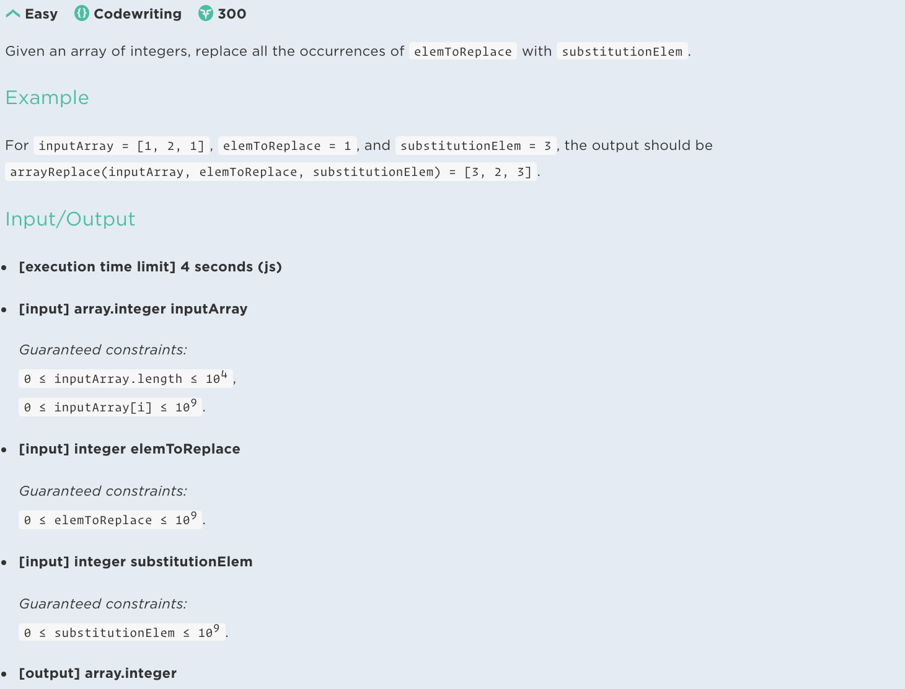

## Problem



## My solution

```javascript
function arrayReplace(inputArray, elemToReplace, substitutionElem) {
  return inputArray.map(elem => elem === elemToReplace ? substitutionElem : elem )
}

arrayReplace([1,2,1], 1, 3)
```

## Solution

```javascript
function arrayReplace(inputArray, elemToReplace, substitutionElem) {
  return inputArray.map(elem => elem === elemToReplace ? substitutionElem : elem )
}

arrayReplace([1,2,1], 1, 3)
```

## Python Solution

```python
def arrayReplace(inputArray, elemToReplace, substitutionElem):
    return [substitutionElem if x==elemToReplace else x for x in inputArray]

```

## What I learned 

- 파이썬 list comprehension if else 구문의 동작방법