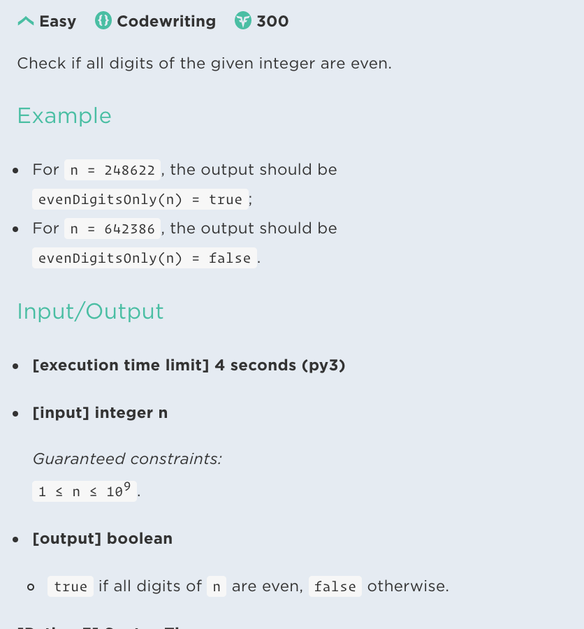

## Problem



## My solution

```javascript
const isEven = n => n % 2 === 0;

const evenDigitsOnly = n => {
  return String(n)
    .split('')
    .every(el => isEven(Number(el)));
};
```

## Solution

```javascript
// 정규식 아이디어
function evenDigitsOnly(n) {
return !(n+'').match(/[13579]/)
}

// 문자열 변환 및 문자에 연산자를 사용하면 다시 형변환된다는 사실
function evenDigitsOnly(n) {
  return (n+"").split("").every(x=>x%2===0)
}

```

## Python Solution

```python
def evenDigitsOnly(n):
    return all([int(i)%2==0 for i in str(n)])
```

## What I learned 

### 문자열 + 산술연산자

- `"2" + 2 = "22"`
- 이외에 다른 연산은 암묵적 형변환이 이루어짐
- `"2" * 3 = 6`
- `"2" % 2 = 0`

### 숫자를 문자로 변환하기 

- `1 + "" = "1"`

### 정규식으로 짝수 점검하기

- `(n+'').match(/[13579]/)`

### 파이썬 All 함수

- [점프 투 파이썬](https://wikidocs.net/32#all) 
- JS every = Py all
- JS some = Py any