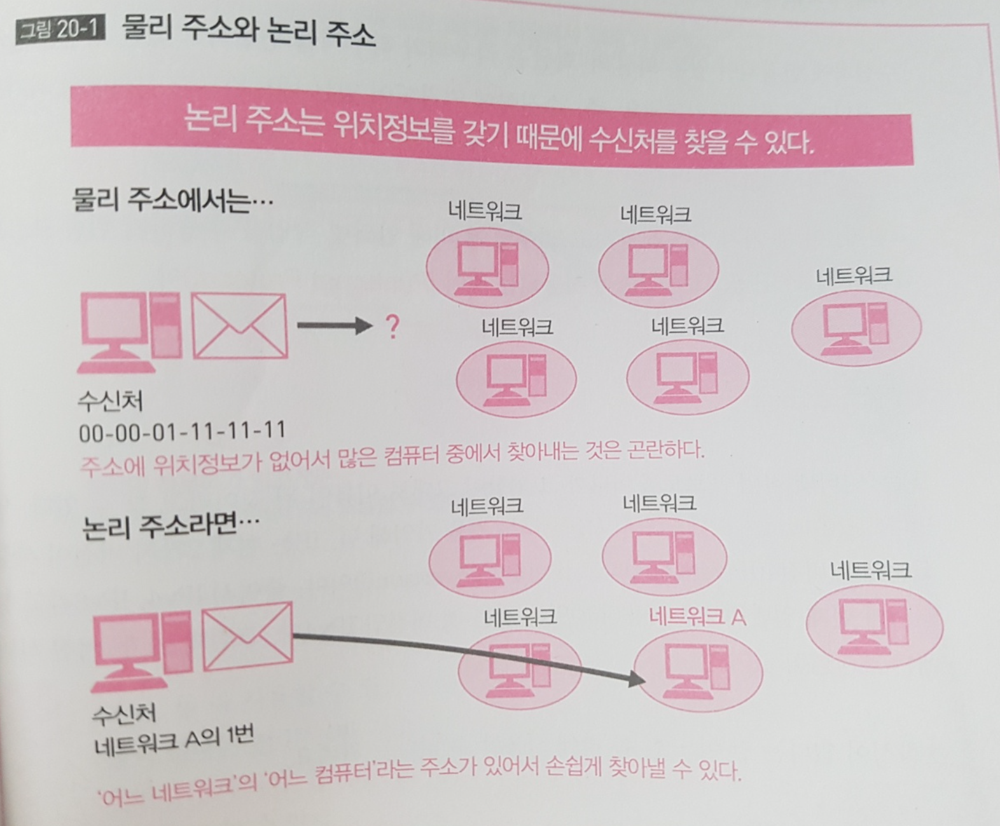
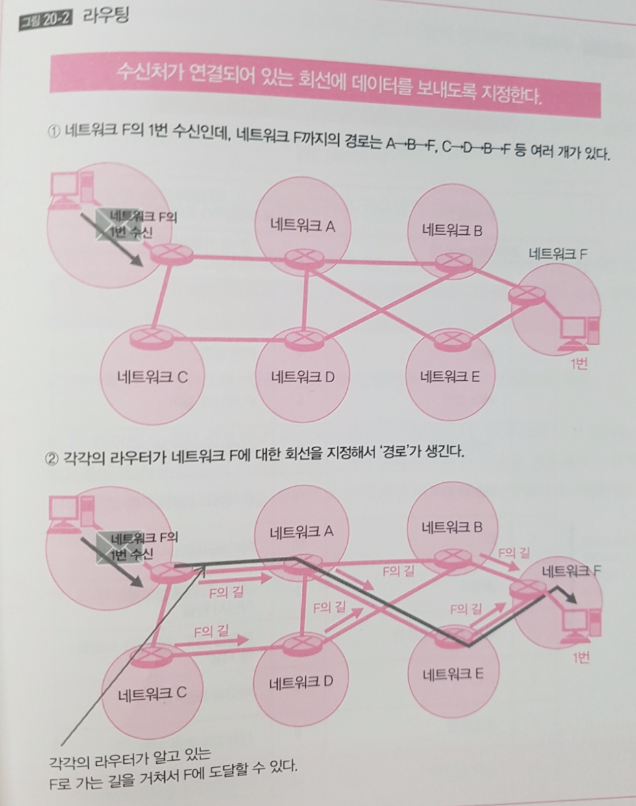
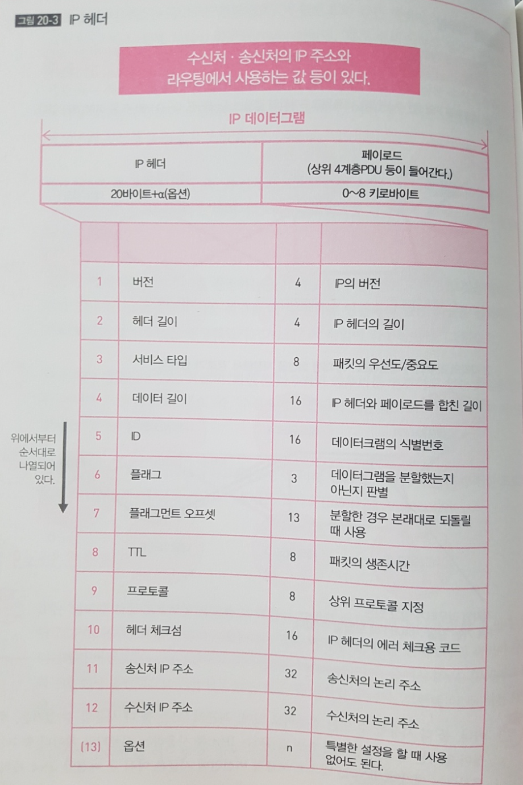

## TL;DR

- 위치정보를 가진 주소가 논리주소이다.
- 수신처까지 경로 선택을 하는 것이 라우팅이다
- TCP/IP에서 인터넷 작업을 수행하는 것이 IP다.

## 3계층의 역할과 IP

- 3계층의 역할은 '인터넷 작업' 을 실현하는 것 &rarr; 인터넷 작업에 의해 네트워크와 네트워크 사이에 데이터 송수신이 가능,
- 인터넷 작업을 하기 위해 필요한 2가지가 있음. 어드레싱과 라우팅.

### 어드레싱

- 2계층의 이더넷에서는 Address 로서 MAC 주소를 사용했지만 3계층에서는 MAC 주소는 사용하지 않음
- MAC 주소는 '장소를 특정할 수 없는 주소' &rarr; MAC 주소는 앞 24 비트가 **'제조업체 번호'** 인 벤더코드, 뒤 24 비트가 제조업체가 붙인 번호(p104 참조) 이므로 장소에 대한 정보가 없음
- 2계층의 '세그먼트 내' 에서의 데이터 송수신에는 이걸로도 충분함, 컴퓨터의 수가 적기 때문
- 3계층의 네트워크를 가로질러 다른 네트워크에 데이터를 전송하게 되면 컴퓨터 수도 비약적으로 많아지니까 '어디' 라는 정보가 없으면 해당 컴퓨터를 찾기 위한 탐색 비용이 올라감, 분류의 필요성이 있음 
- 특정 값 하나늘 찾기 위해 전체 MAC 주소를 탐색하는 알고리즘을 생각해보면 O(N) 시간이 걸림
- 때문에 2계층과 3계층에서 각각 다른 주소 체계를 사용함. 
- 3계층에서는 사용하는 주소를 **논리주소** 라고 부르고 **이 주소는 어디에 있는지와 같은 위치정보를 표현함**, 이 정보로 데이터의 수신처를 찾을 수 있음, **위치정보는 어디의 네트워크에 있는 어느 컴퓨터라는 정보의 조합으로 실현됨**, 논리주소는 '주소' 와 '전화번호' 같은 형태
- 2계층에서 사용하는 주소를 **물리주소** 라고 부름. MAC 주소가 이에 해당함. 
- '물리주소' 와 '논리주소' 의 차이는 주소에 위치정보가 포함되어 있는지 없는 하는 점.

### 라우팅

- '경로 선택' 즉 **수신처까지 어떤 경로를 갈 지를 결정**하는 것을 말함 

- **ex) 복수의 네트워크가 연결되어 있는 상태에서 전달하고 싶은 수신처가 여러 개의 네트워크를 경우해야 도달하는 경우가 있다면?** 

- 이런 경우 어느 네트워크를 경우해서 갈지 미리 결정 해 놓으면 탐색 비용이 덜듬 

- 수신처가 X라고 하면 A라는 네트워크를 경우해서 다음에 B라는 네트워크를 지나고 이어서 C라는 네트워크를 경유해서 X까지 간다고 결정해 두는 것임
- **경유하는 네트워크를 결정하는 것이 라우팅**임. 그리고 **그것을 행하는 기기가 '라우터'** , **패킷 교환기를 말할 때 '수신처에 연결되어 있는 회선을 선택해서 거기로 패킷을 송신한다' 고 말하는데 이 작업이 바로 라우팅을 말함**
- '수신처에 연결되어 있는 회선' 의  '회선'은 라우터와 라우터를 연결하고 있는 회선을 말하고 그것이 결국 네트워크임, 즉 **수신처에 연결되어 있는 네트워크를 선택해서 거기로 보내는 것이 라우팅**

### IP(Internet Protocol)

- 결론적으로 '어드레싱'과 '라우팅'에 의해 인터넷 작업을 수행하기 위한 프로토콜로서 TCP/IP 프로토콜군에서 사용되는 것이 IP(internet Protocol)

- TCP/IP 에서는 IP를 반드시 사용한다. IP는 현재 2가지 버전이 사용되는데 IP4(IP version4)하고 IP6(IP version6) 가 있다. 참고로 두 버전 사이에는 호환성이 없다. 최근 OS는 둘 다 사용할 수 있는데, 호환성이 없다는 건 IPv4 만 사용하는 컴퓨터는 IPv6를 사용하는 컴퓨터와 데이터 송수신을 못한다는 이야기다.
- IP는 인터넷 작업을 수행하기 위한 기능을 가진다. 인터넷 작업은 '어드레싱', '라우팅'을 말한다.
- IP가 인터넷 작업을 실현하기 위해 하는 일은 IP가 데이터에 붙이는 헤더를 보면 잘 알 수 있다. 
- IP 헤더 그리고 3계층 PDU, 그러니까 데이터에 **IP 헤더가 붙은 상태의 PDU는 IP 데이터 그램**이라고 불린다.

- IP 헤더에서 중요한 것은 송신처와 수신처의 IP주소임
- IP 주소라는 것 IP라는 프로토콜에서 정해진 '논리 주소'를 말하는 건데 IP 에서는 이 IP 주소를 사용해서 수신처와 이 송신처를 정함

> ## 참고 
> - [하루 3분 네트워크 교실, 아이노 에이미 저, 이현주 옮김](http://www.kyobobook.co.kr/product/detailViewKor.laf?mallGb=KOR&ejkGb=KOR&linkClass=3309&barcode=9788931454727)