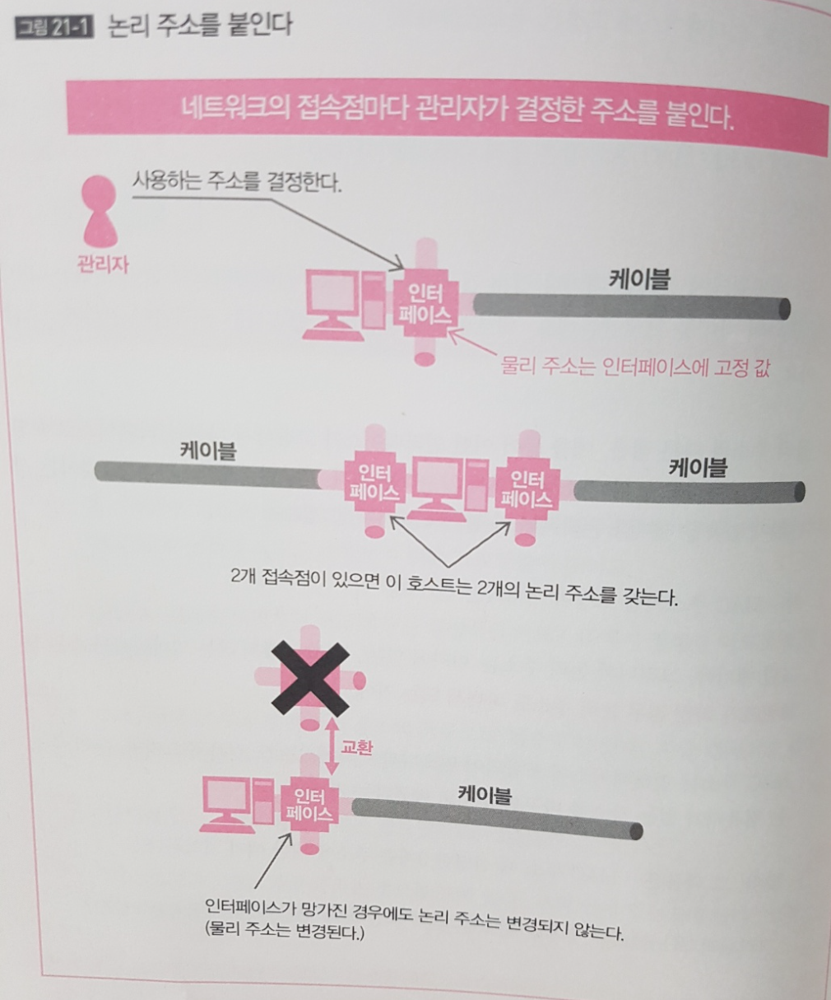
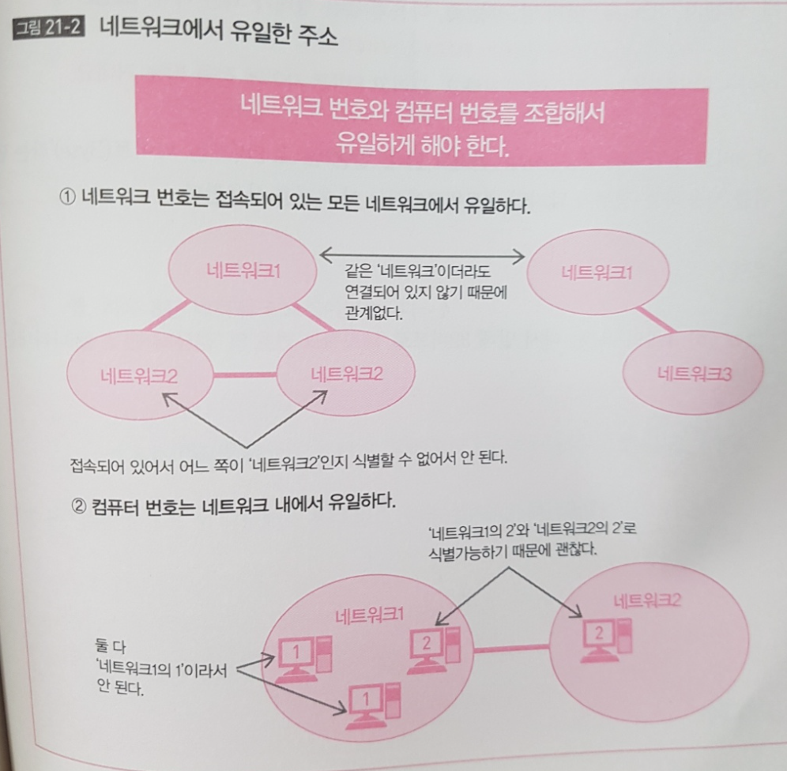
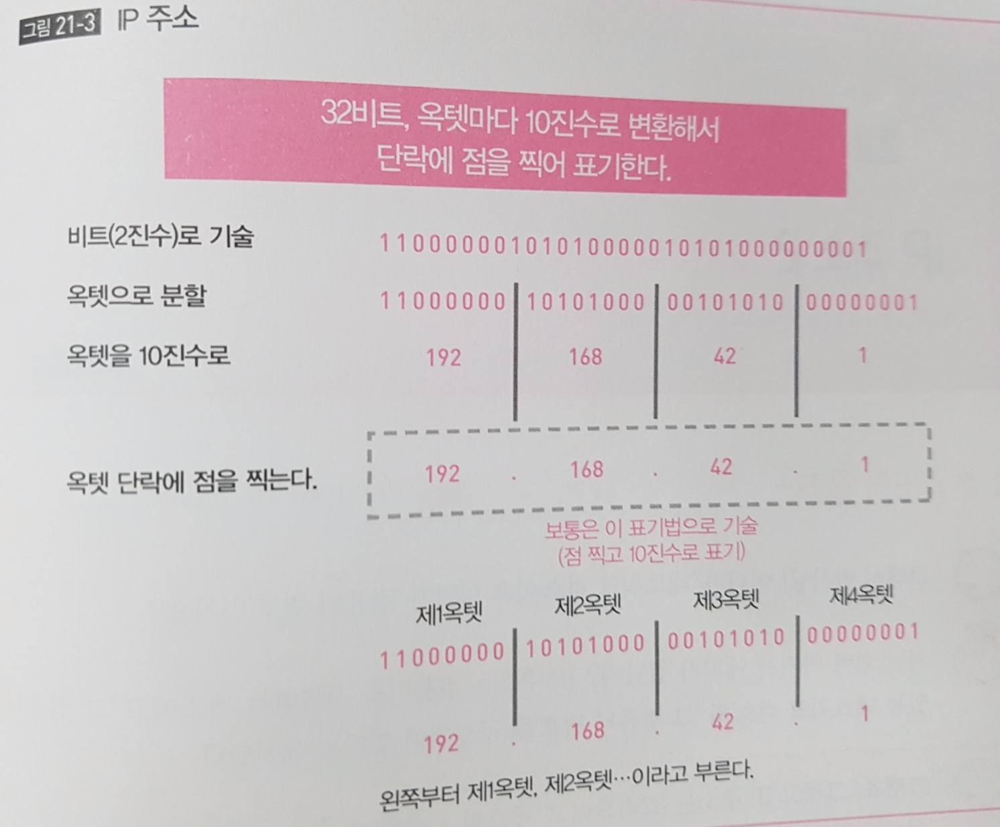
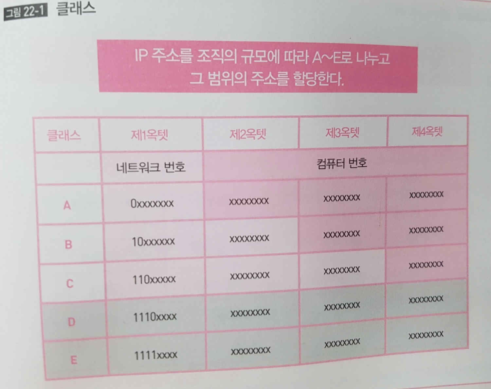
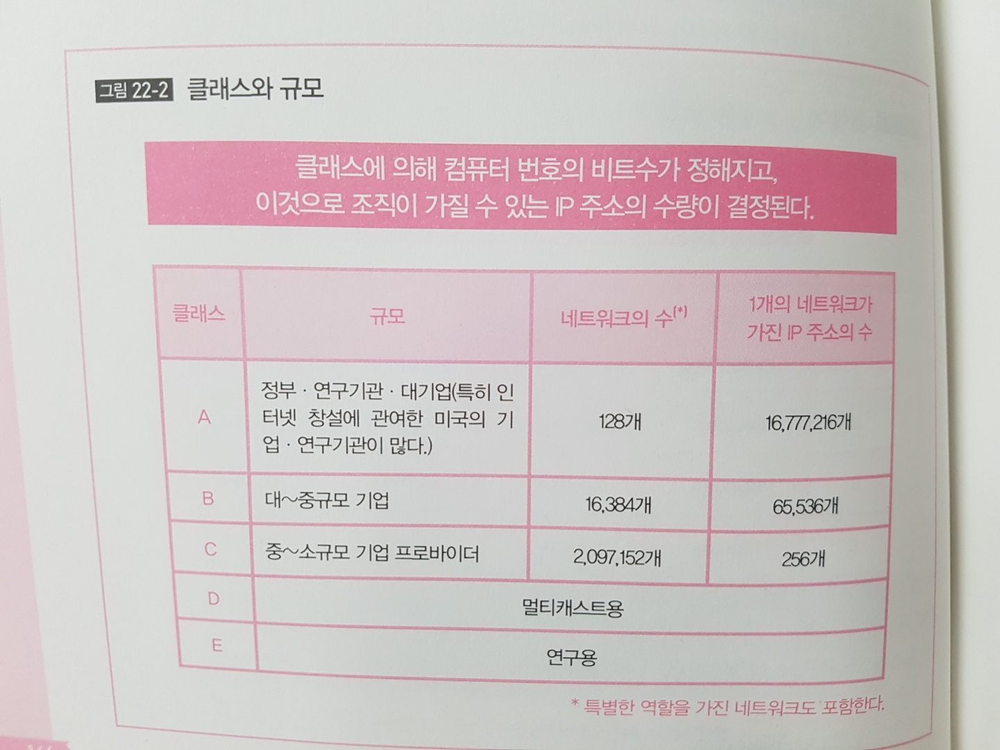

## TL;DR

- IP 주소는 계층형이고, 32비트의 주소다.
- IP 주소는 '네트워크 번호'와 '컴퓨터 번호'의 조합이다.
- 네트워크 번호는 접속되어 있는 모든 네트워크에서 유일해야 하고, 컴퓨터 번호는 그 네트워크 내에서 유일해야 한다.
- 8비트를 1옥텟으로 하여 4개의 옥텟으로 분할해서 포기한다.

## 배경지식 정리

- 인터넷 작업에 필요한 것이 '어드레싱' 과 '라우팅' 이다. 이 두가지를 수행해서 TCP/IP로 인터넷 작업을 수행하기 위한 프로토콜이 IP 이다.
- **어드레싱은 IP에서 정해진 어드레스 IP 주소**이다.

## IP 주소의 특징

### 계층형

- IP 주소는 논리 주소이다. 논리 주소는 계층형이라는 특징을 가진다. 
- '어디에 있는', '어느 컴퓨터' 라는 정보를 'A' 에 있다, 'A안에 B에 있다', 'C라는 컴퓨터' 와 같이 더 세분화 할 수 있고 이런 주소를 **계층형** 주소라고 부른다.
- 현실의 예를 들어보면 '서울'의 '금천구' 의 ' 가산디지털 2로'의 '123' 같은 구조이다. 

### 네트워크 관리자가 컴퓨터에 할당

#### 컴퓨터가 있는 장소를 바꾸면 논리 주소도 바뀐다.

- MAC 주소는 IEEE가 붙인 벤더코드와 벤더가 붙인 할당코드로 이루어져 있어 사용하는 쪽에서는 변경이 불가능하다. 즉 인터페이스에 고정된 주소이다.
- 하지만 논리주소는 그 네트워크의 관리자가 필요에 따라 자유롭게 붙일 수가 있다. 또한 물리주소는 MAC 주소 같은 물리 주소와는 다르게 네트워크에 접속할 때마다 붙인다.
- 예를 들면 **어떤 인터페이스가 고장나서 다른 인터페이스로 교환했다고 하더라도 논리 주소는 바뀌지 않는다.(장소가 바뀌지 않는 다는 가정하에)** 즉 인터페이스가 어느 것이든 상관없이 접속할 때마다 논리 주소를 붙인다.  MAC 주소 처럼 고정이 아니기 때문에 가능하다.
- 다만 논리주소는 '어디에 있는', '어느 컴퓨터' 라는 의미니까 소속된 네트워크가 바뀐 경우에 논리 주소를 바꾼다. 다시 설명하면 MAC 주소는 인터페이스에 포함되어 어디에 있어도 같은 주소를 가지지만, **논리 주소는 컴퓨터가 있는 장소를 바꾸면 주소도 바뀐다.**

#### 3계층의 주소 

- 3계층에는 3가지 주소가 있다. 유니캐스트, 멀티캐스트, 브로드캐스트 3종류의 주소가 있다.
- 유니캐스트의 주소의 논리 주소 중 네**트워크를 표시하는 번호는 접속되어 있는 모든 네트워크에 유일할 필요가 있다.**

- 다시 말하면 접속되어 있지 않으면 유일하지 않아도 된다. 독립한(서로 다른) 네트워크끼리면 주소가 동일해도 상관없다. 통신할 때 구별할 필요가 없기 때문이다. 
- 하지만 **컴퓨터 번호는 소속된 네트워크 내에서 유일해야 한다.** 
- 예를 들면 ''가산 디지털 2로' 라는 주소라도 서울시, 안산시 처럼 시가 다르면 서로 다른 주소라는 것을 알 수 있다. 다른 네트워크에 같은 번호를 가진 것이 있어도 네트워크 번호가 다르면 결과적으로 유일하게 된다.

## IP 주소

- MAC 주소는 16진수 12자리, 48 비트였으나, IP 주소는 32비트(IPv4 기준) 이다. (IPv6는 128비트)
- 8비트 마다 10진수로 표기하고, 8비트 사이에 점을 찍어 표현한다.
- 이 8비트의 단락을 **옥텟(Octet)**이라 부른다. 일반적으로 8비트는 '바이트(Byte)'를 단위로 사용하지만 네트워크에서는 옥텟을 사용한다.

- 4개의 옥텟(32비트)으로 '네트워크 번호'의 '컴퓨터 번호'를 나타낸다. 

## IP 주소의 클래스

- 어디부터 '네트워크 번호' 이고  어디부터 '컴퓨터 번호' 인지 결정하기 위해 **클래스**에 대한 개념이 필요하다.
- 네트워크 번호는 접속되어 있는 모든 네트워크에서 유일해야 한다. 인터넷의 경우 인터넷에 접속되어 있는 네트워크 전체에서 유일하고, **네트워크 번호가 제멋대로 정해지는 것은 곤란하기 때문에 인터넷에서는 ICANN(The Internet Coporation for Assigned Names and Number) 라는 조직에서 실제 번호를 사용하는 조직에 할당한다.** 

- ICANN 은 IP주소를 유일하게 관리하기 위한 단체인데, ICANN이 IP 주소를 실제로 사용한 인터넷 사업자나 기업 등에 할당한다. 쉽게 말해 ICANN이 IP 주소를 가지고 있다가 그것을 기업이나 인터넷 사업자에게 빌려준다고 생각하면 된다.
- ICANN 은 빌려줄 때, 그 할당된 조직의 규모에 따라 빌려줄 IP 의 범위를 변경하는데, 그게 **클래스** 이다.

- 클래스는 A~E의 5개로 나뉘어 있다. 클래스 A는 최초의 8비트, 즉 최초의 옥텟이 네트워크 번호이고, 나머지가 컴퓨터 번호다. 클래스 B는 16비트와 16비트, 클래스 C는 24비트와 8비트, 클래스 D와 E는 특별한 주소라 보통은 할당하지 않는다. 
- **클래스 D와 E를 식별하기 위해 최초 옥텟의 맨앞 몇 비트로 판별한다** 
- 구별을 위한 예를 들어보면 IP 주소 32 비트의 1비트와 2비트 '1', '0' 이라면 클래스 B이다.
- IP 주소의 선두가 '10, 1,1,1' 이라면 32비트에서는'00001010000000100000010000001'' 이고, 선두 비트가 0 이니까 클래스 A가 된다. 
- 네트워크 번호 부분의 비트수가 적으면 그만큼 컴퓨터 번호 부분의 비트수가 많아지게 된다.
- **비트수가 많다는 건 그만큼 사용할 수 있는 번호가 많아 진다는 의미이고, 그만큼 많은 컴퓨터를 소유하는 네트워크가 될 수 있다.**

- 클래스 A 일 때, 네크워크 번화 8비트, 컴퓨터 번호가 24비트 이기 때문에, 2의 24승 즉 ,16,772,216개의 컴퓨터를 가질 수 있다.
- 큰 규모의 네트워크에는 A를 작은 규모에는 C를 할당한다. 가장 가까운 예가 전화번호의 지역번호이다. 경기도는 '032', 3자리 인데 서울만 '02' 두 자리이다. 일반 전화 번호는 10자리 인데 만약 지역번호가 크면 지역번호 + 가입자번호 부분이 작아진다. 즉 고유 번호의 수가 줄게 된다. 서울이라면 10 자리에서 두 자리를 뺀 8자리 그러니까 0~999999999 까지 1억개를 가질 수 있다. 지역번호 3자리의 경우, 0~9999999 천만개 밖에 생성할 수 없다.
- 이처럼 클래스로 나누어 IP 주소를 할당하는 방식을  클래스풀 어드레싱(Classfull Adressing) 이라고 한다. 

## 예약 완료 주소 

- 네트워크 번호가 몇 비트인지는 할당된 클래스에 따라 정해지는데, ICANN이 할당하는 것은 이 네트워크 번호까지 이다. 
- 네트워크 번호를 할당하면 컴퓨터 번호, 이 것을 **호트스 번호** 라고 한다. 호스트 번호는 그 네트워크의 관리자가 임의로 정할 수 있다.
- 예를들면 '02' 지역번호를 정하면 다음 자리수는 네트워크 관리자가 임의로 부여할 수 있다는 말이다.

 

- **단, 이 호스트 번호 중에는 특별한 의미를 가지기 때문에 실제의 컴퓨터에 할당하면 안되는 주소가 존재한다. 호스트 번호가 모두 0이 되는 주소와 호스트 번호의 비트가 모두 1인주소이다.**
- 예를 들면 클래스 C에서 네트워크 번호가 192.168.10 인 경우, 192.168.10.0 인 경우, 192.168.10.255