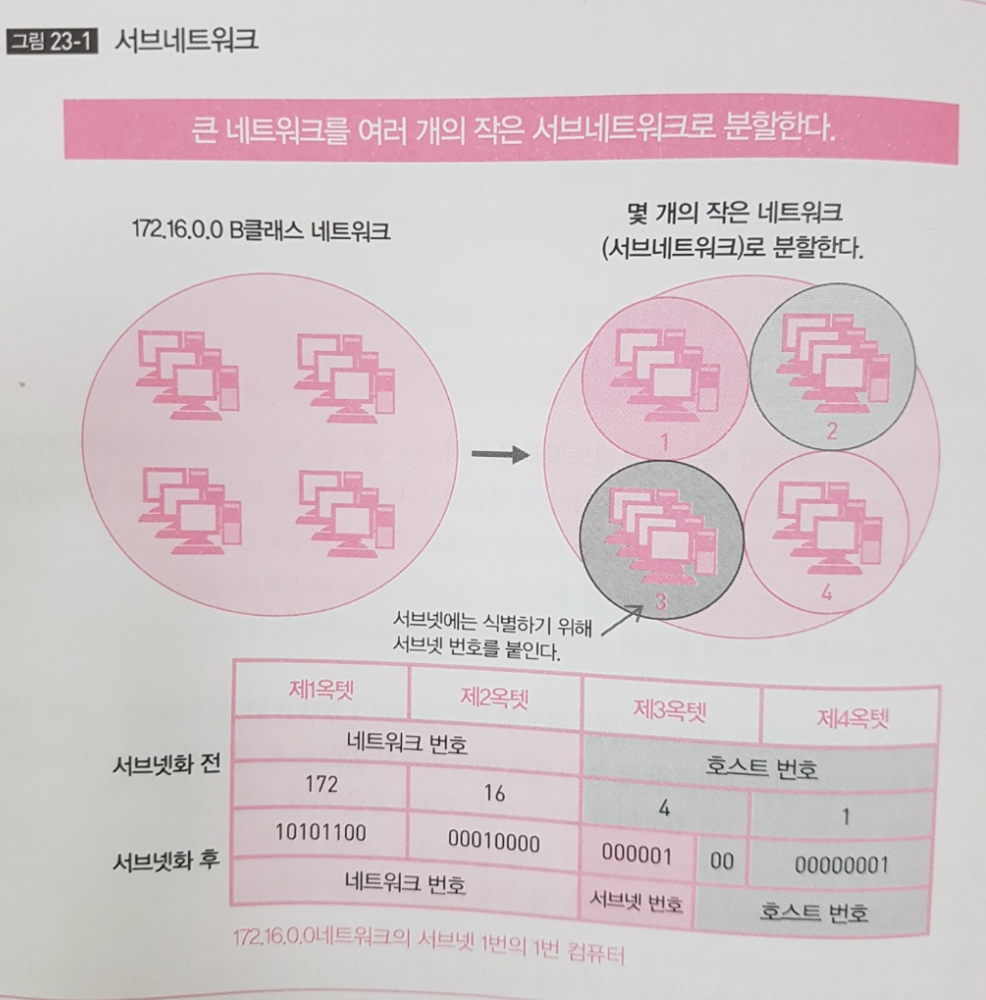

## 네트워크를 분할한다

- IP 주소는 클래스에 따라 네트워크 번호와 호스트 번호로 구성되어 있고, 조직의 규모에 따라 네트워크 번호의 비트수가 결정된다. 

- ICANN 이 조직의 규모에 따라 할당하는 IP 주소의 클래스를 정하고, 클래스가 정해지면 그에 따라 네트워크 번호의 비트 수가 결정된다. 

- **'IP 주소의 클래스 A'** 의 예를 들어 생각해보자. 클래스 A의 네트워크 호스트 번호는 24 비트이다. 즉  **17.772.214 (2^24)대**의 호스트(컴퓨터)를 소유할 수 있다. 이 네트워크가 800 만대의 컴퓨터를 갖는다고 하고, 네트워크 관리자가 각 컴퓨터에 번호를 할당해야 한다고 가정하자. 무척 어려운 일이다. 800만 개를 하나 하나 순서대로 할당한다 하더라도 해당 번호의 컴퓨터가 어디에 무슨 컴퓨터인지 알 수 없다.

- **IP 주소는 계층형이다.** 커다란 네트워크를 몇 개의 네트워크로 분할할 수 있다는 뜻이다. 이렇게 분할 된 네트워크를 **서브네트워크** 또는 서브넷(Subnet)이라 한다. 큰 네트워크를 잘게 나눠 관리하기 쉽게 한 것이다. 

- 서브넷으로 분할할 때는 서브네트워크를 나타내는 번호인 서브넷 번호가 필요하다. 하지만 IP 주소는 32비트로 고정되어 있어 새롭게 서브넷 번호를 추가하는 것이 불가능하다. 그래서 **호스트 번호의 비트를 서브넷 번호와 호스트 번호로 분할한다. 호스트 번호의 일부를 줄여서 서브넷 번호를 만드는 것이다.**

- 예를 들어, 클래스 B 네트워크의 172.16.0.0 있다고 하자. 이 호스트 번호 16비트를 서브넷 번호 6비트와 호스트 번호 10 비트로 분할한다. 이 상태에서 서브네트워크 1번의 호스트 번호 1번 컴퓨터의 IP 주소는 아래 그림과 같다.

  

