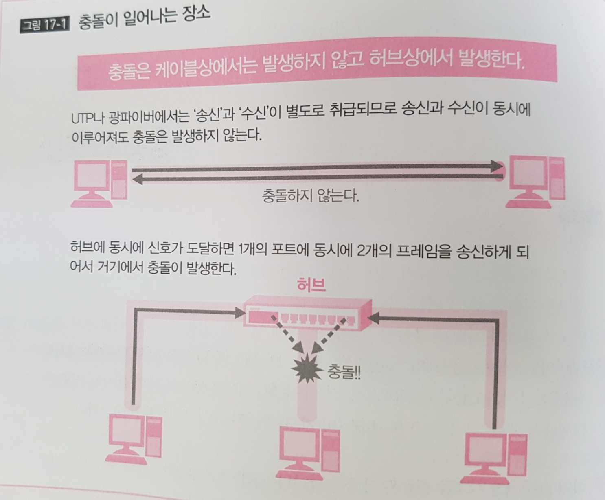
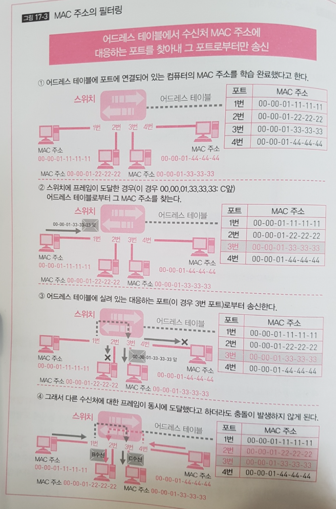
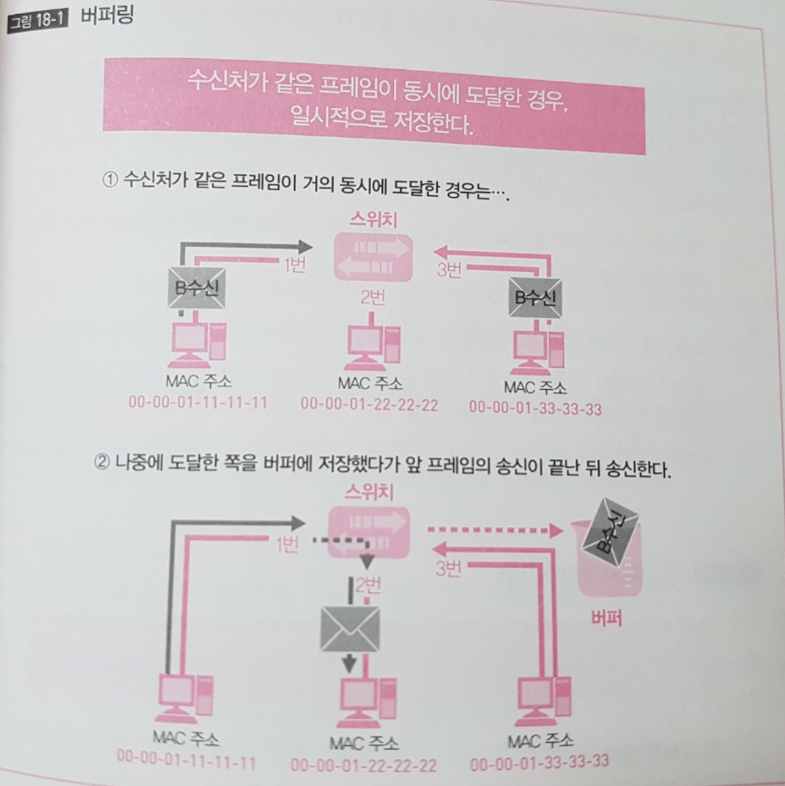
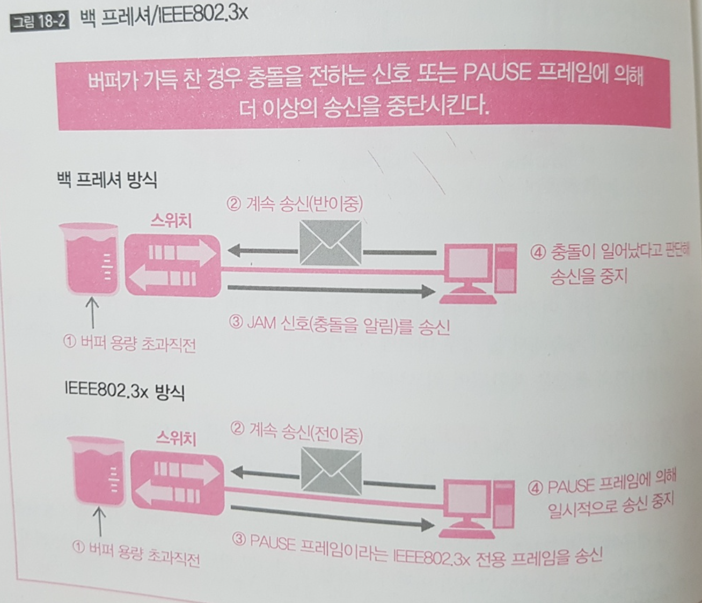
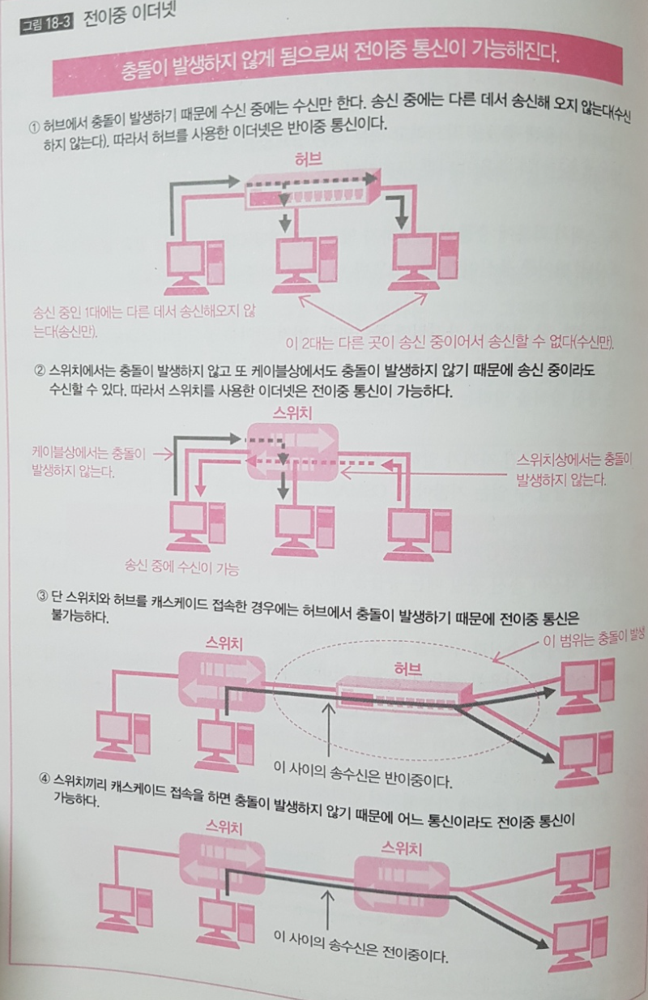

## 2계층의 역할과 개요 
### 여러개의 컴퓨터가 허브에 연결되어 있을때
- 컴퓨터에서 송신된 신호가 허브에 도달하면 허브는 신호를 수신한 포트 이외의 모든 포트에 신호를 송신 &rarr; 허브에 연결되어있는 다른 컴퓨터에 도달 
- **1대에만 도달하도록 하는 방법**을 생각해야할 필요 있음 
- 또 여러 대의 컴퓨터가 허브에 연결되어 있으면 우연히 동시에 송신한 경우에 신호 충돌이 일어남
- 신호의 송신 전이나 수신 후에 바르게 데이터를 송수신하는 순서가 필요함(충돌을 막기 위함)

### 세그먼트 범위
- 신호가 닿는 범위 
- 멀티 엑세스 네트워크라면 허브로 연결되어 있는 기기 전체
- 포인트 투 포인트 네트워크 라면 서로 연결되어 있는 두대

### 프레이밍과 신호의 동기
- 1계층에서 주고받는 신호를 비트화해 거기에 의미를 갖게 하는 것이 프레이밍
- 2계층의 PDU(Protocol Data Unit:PDU, 데이터와 데이터를 보내기 위해 필요한 것들이 통합된 상태)
- 프레이밍을 시행함으로써 송수신되는 신호를 '데이터' 로 인식할 수 있게됨

- 프리엠블(데이터의 시작) 신호로 시작하고
- 이어서 데이터 비트를 신호화해서 붙여 송신
- 비트를 신화할 때 1비트분의 신호의 폭을 정했다.
- 신호를 제대로 다루기 위해서는 비트를 읽는 타이밍이 송신측과 수신측 양쪽이 일치해야 한다. 이게 어긋나면 비트 중간부터 읽기 시작하게 된다.
- 이 타이밍을 맞추는 방법으로 데이터를 송수신하지 않는 상태에서도 **Clock 신호**라고 부르는 **타이밍을 맞추는 신호**를 보내는 방법이 있음 &rarr; 동기 통신
- 동기 통신의 경우 **프리엠블**을 사용하지 않지만 지속적으로 신호를 보내야 하는 비용이 들기 때문에 프리엠블을 사용
- **프리엠블**을 보냄으로써 이제부터 데이터가시작된다는 것을 알게 되기 때문에 비트를 읽을 타이밍을 이 **프리엠블** 에서 맞춤
- 이너넷의 경우 **1** 과 **0**을 교대로 프리엠블로 보내는데 이것을 읽고 수신측에서 비트를 읽는 타이밍을 맞춤 

- 패킷을 사용한 패킷 교환 방식에서 프리엠블 방식이 일반적 

## 2계층의 주소와 이더넷 

### TL;DR

- 1대 1인 유니케스트, 1대 전체인 브로드캐스트, 1대 다수인 멀티캐스트가 있다
- 기기는 한 개 이상의 유니캐스트 주소를 가진다.
- 이너넷에는 MAC 주소가 사용된다. 

### 주소와 캐스트
- 주소: 데이터를 보내는 상대와 자신을 특정하는 데이터
- 어드레싱(addressing): 주소를 어떻게 사용하지 어떻게 배정할지 결정하는 것
- 유니케스트: 1 대 1 데이터 통신
- 브로드캐스트: 전원, 즉 모두에게 메시지를 보내는 데이터 통신 
- 멀티캐스트: 1대 다수, 지정된 복수의 기기로 메시지를 보내는 데이터 통신 

### MAC 주소 
- 각각의 기기는 유니캐스트 주소를 적어도 한개 이상 가진다.
**라우터처럼 복수의 인터페이스를 가진 기기는 인터페이스마다 유니캐스트 주소를 갖는**
- 유니캐스트 주소는 유일하다. 
- 이더넷에서 사용되는 주소는 MAC 주소(Media Access Control Address)이며, 이 주소는 인터페이스에 지정된 고정 주소다.
- 인터페이스가 고장나서 다른 인터페이스로 교환하거나 하면 MAC 주소도 변경된다. MAC 주소는 48비트 값으로 4비트마다 16진수로 고쳐서 쓴다. 
- MAC 주소의 선두 24비트는**벤더코드** 라 불리며 인터페이스를 제조한 메이커 번호다.
- MAC 주소 후반의 24비트는**벤더 할당 코드**이다

## 이더넷

### TLDR 

- 이더넷에서는 수신처와 송신처의 MAC 주소, 에러 체크 등을 헤더, 트레일러로 붙인다.
- 수신한 프레임의 수신처가 자기가 아닌 경우는 파기한다. 
- 되도록 충돌을 막기 위해 CSMA/CD를 사용한다 

### 이더넷 프레임
- 2계층의 프로토콜은 LAN, WAN 에 따라 달라지는데, LAN 에서는 이더넷 이라는 규칙이 사용됨 
  
- 이너넷이 사용되는 주소가 바로 MAC 이며, 이 주소를 써서 수신처와 송신처를 특정함
- 그 주소를 사용해 누구로 부터, 어디로를 결정하고 헤더에 기술(표기) 해서 송신함
- 이더넷에서는 이더넷 헤더와 이더넷 트레일러 를 데이터그램에 붙여서 이더넷 프레임으로 캡슐화 하고, 이 이더넷 프레임이 신호가 돼서 케이블로 전달됨  (데이터 그램? 메시지에 4계층 제어정보를 덧붙인 상태를 세그먼트, 또는 데이터 그램이라 부름, 3계층의 제어정보를 덧붙인 상태를 데이터 그램이라 부름, 실제로는 그 앞에 프로토콜명을 붙어서  "TCP 세그먼트라던가, IP 데이터그램이라고 부름
- 헤더에는 수신처의 주소, 송신처의 주소, 페이로드의 내용을 식별하는 타입이 붙고, 트레일러에는 에러를 체크하는 FCS(Frame Check Sequence?)가 붙는다 
- 신호가 전송되는 동안에 문제가 생겨서 정확하게 읽을 수 없게 되거나 '0'  과 '1' 로 또는 그 반대로 읽어버리는 경우가 있다. 그런 에러를 처리하기 위해 FCS 를 붙여둔다.
- 기본적으로 통신중에는 에러를 고칠 수 없다. '바른 데이터' 인지 아닌지는 에러가 발생하지 않는 데이터를 수신하지 않는 한 알 수 없기 때문이다.
- FCS는 에러가 발생했는지 아닌지는 알지만 어느 상태가 올바른 상태인지는 모른다. 
- 결과적으로 통신 도중에 에러를 고칠 수 없고, 에러가 있었던 프레임은 파기한다. 그 시점에서 버려지고 이후의 처리는 하지 않고, 파기사실은 송신측에 알리지 않는다. 

### 이더넷 동작 
- LAN 에서 허브를 사용한 멀티엑세스 네트워크를 채용하는 경우가 많다. 
- 허브를 사용한 경우 '허브는 수신한 포트 이외의 모든 포트를 통해 수신한 신호를 송신하는 플러딩' 을 하고 그래서 출동이 발생한다.
- 허브를 사용한 멀티엑세스 네트워크의 경우 신호, 즉 데이터는 모든 기기에 도달하게 되기 때문에, 이더넷에서는**수신한 프레임의 수신처 MAC 주소를 보고 자기에게 온 것 외의 다른 프레임을 파기한다**
- 특정 수신처에만 도달하는 것이 아니라 각 포트에서 자기가 수신처가 아닌 경우 해당 신호를 보지 않는 것이다.

### CSMA/CD (Carrier Sense Mulitple Access/Collision Detection)
- 멀티 엑세스 네트워크의 경우 동시에 신호를 보내면 도중에 신호가 충돌해서 읽을 수 없게될 가능성이 있다. 
- 이더넷에서는 '신호를 보내는 타이밍을 겹치지 않도록 비켜나게' 함으로써 되도록 충돌이 일어나지 않도록하느데 이를 위해 CSMA/CD 라는 엑세스 제어를 한다

- 엑세스 제어란, 인터페이스에 연결되어 있는 케이블에 신호를 보내는 엑세를 제어를 말한다.
- CSMA/CD 를 간단히 말하면 'CS(신호 감지) 는 누군가가 송신 중 이라면 송신하지 않는다' 이고 'MA(다중 엑세스)아무도 송신하고 있지 않다면 송신할 수 있다' 이고 'CD(충돌검사)는 송신 후에 충돌이 일어나면 다시 재수행한다' 라는 의미
- 가끔 아무도 송신하지 않다는 것을 확인하고 나면 충돌이 발생하지 않을 것 같지만 동시에 2대가 신호를 감지해버리면 2대가 송신을 시작하고, 충돌이 발생함 
- 타이밍을 엇갈리게 하기는 하지만 어쩌다가 일치해 버리면 막을 수 없다. 

## 스위치 

### TL;DR

- 충돌은 허브에서 발생한다.
- 스위치는 "MAC" 주소 필터링과 '버퍼링' 으로 충돌을 막는다. 
- 수신처 MAC 주소에 대응한 포트만 프레임을 송신하는 것이 MAC 주소 필터링이다.

### 충돌은 어디서 발생하는가?(허브와 스위치)

- 이더넷의 CSMA/CD 는 충돌을 '막는' 것이 아니라, '일어나기 어렵게' 하는 것
- 이더넷의 CSMA/CD 로는 충돌이 없어지지 않는다.
- 충돌도메인(그 범위 내의 컴퓨터가 송신하면 다른 컴퓨터의 송신하고 충돌할 가능성이 있는 범위) 내의 컴퓨터 수가 많다면, CSMA/CD  가 있어도  충돌가능성이  높고, 효율이 나쁨 &rarr; 충돌이 발생하면 충돌이 발생한 컴퓨터는 잠시 대기하고 재송신, 충돌 도메인 컴퓨터의 수가 많으면 ''송신 &rarr; 충돌 &rarr; 재송신 &rarr; 충돌'  로 같은 일이 벌어짐
- 결국 충돌을 피하기 위해서 '신호를 보내는 타이밍이 겹치지 않도록 엇갈리게 하는 방법' 과 '신호가 지나는 길을 나누는 방법'이 있음 
**신호를 나누기 위한 방법**` 이` 스위치이며, **스위치를 허브대신 사용** 하면 충돌을 해결할 수 있음
- 스위치도 허브와 마찬가지로 복수의 포트를 가짐, 컴퓨터를 스위치에 연결함으로써 다른 컴퓨터와의 사이에서 신호를 송수신할 수 있게됨
- 스위치가 어떻게 충돌을 막는가? &rarr; 포인트는 **어디에서 충돌이 일어나고 있는가**임
- LAN 에서 사용되고 있는 UTP나 광파이버 케이블은**송신 신호와 수신 신호가 나뉘어있어** 케이블상에서는 자신이 송신한 신호와 상대가 보낸 신호가 동시에 지나가도 충돌이 발생하지 않음,**충돌은 허브에서 일어남 , 허브가 동시에 2개 이상의 기기로 부터 신호를 수신하면 허브는 그것을 나누어 보낼 수 없음**, 그래서 충돌이 발생

### MAC 주소 필터링 

- 허브대신 스위치로 치환해서**수신한 프레임을 따로따로 보낼 수 있도록 처리해서 충돌을 막아야 하는데 그 방법이 바로 MAC 주소 필터링과 버퍼링**임
- MAC 주소 필터링은**학습**과 **스위칭** 이라는 동작으로 나누어짐 
- 우선**`학습은 수신한 프레임의 송신처 MAC 주소를 기억**하는 것,**학습으로 수신한 포트와 MAC 주소를 대응시키는 대응표를 만들고** 이 대응표를 **어드레스 테이블** 이라고 함
- 학습에 의해 스위치는 포트에 연결되어 있는 컴퓨터의 MAC 주소를 기억할 수 있음
- 이제 프레임을 수신한 스위치는 프레임의 수신처 MAC 주소를 보고 그 MAC 주소가 있는 포트에만 프레임을 송신할 수 있음, 이게 가능한 이유는  '학습' 을 통해 어드레스 테이블을 가지고 있기 때문
- 그 결과 수신처가 다른 프레임이 동시에 스위치에 도달해도 충돌은 발생하지 않게됨, 허브라면 어떤 프레임이 도달해도 플러딩하려고 하니까 동시에 도달한 경우에는 충돌이 발생하지만, 스위치에서는 충돌 발생 X 

- 이 동작은 MAC 주소에 의해 송신하는 포트를 필터링 하기 때문에 MAC 주소 필터링라 함 
- MAC 주소 필터링에 주의할 점 &rarr; 스위치는 먼저 주소를 '학습' 하고 포트와 MAC 주소의 대응표인 어드레스 테이블을 만들어야 함, 만약 MAC 주소가 송신처의 프레임을 수신하기 전이어서 '학습하지 않은' 상태라면 MAC 주소 필터링을 할 수 없음
- 이 경우에 '학습전의 MAC 주소 수신의 프레임을 수신한 ' 경우 +  수신처가 1대 가 아닌 멀티캐스트와 브로드캐스트 수신처인 프레임을 수신한 경우에는 허브와 마찬가지로 플러딩을 하게됨 
**수신처가 다른 프레임이 동시에 스위치에 도달해도 충돌은 발생하지 않는다** 고 했는데,**수신처가 같은 프레임이 동시에 도달한 경우도 있다. ** 그 경우에는 또 충돌의 가능성이 있는데 이 때문에 또 하나의 동작**버퍼** 이 필요해짐 

## 전이중 이더넷 

### TL;DR

- 버퍼링으로 수신처가 같은 프레임의 충돌을 막는다.
- 스위치를 사용함으로써 CSMA/CD를 사용할 필요가 없다. &rarr; 전이중 이더넷이 가능해진다.

### 버퍼링

- **수친처가 다른 프레임이 동시에 도달**하면 **MAC 주소 필터링**으로 해결하지만 **수신처가 같은 프레임이 동시에 도덜**하면 새로운 해결 방법이 필요하다. 

- 새로운 해결 방법이 바로**버퍼(Buffer)** 를 사용해 처리하는 버퍼링이다. 버퍼는 일시적으로 데이터를 기록해 둘 수 있는 기억기기(메모리)다. 
- 수신처가 같은 프레임이 동시에 도달하면 그 수신처가 연결되어 있는 포트로부터 송신하려고 한다. 하지만 포트는 한 개 밖에 없어서 충돌이 발생한다. 
- 이 때 충돌이 발생하지 않도록 **충돌할 것 같은 프레임을 버퍼에 저장해둔다.** 수신처가 같은 프레임이 두개 도달했을 경우 한 개는 송신하고 나머지 한 개는 일시적으로 버퍼에 저장 &rarr;**첫 번째 프레임 송신이 끝나면 저장해 두었던 프레임을 송신시킴**  이것이 버퍼링

- 그러나 **버퍼의 용량**에 유의해야 한다. 만약 수신처가 같은 프레임이 계속해서 올 경우 버퍼에 저장할 수는 있지만 무한대로 저장은 불가하다. 메모리의 용량은 제한되어 있기 때문이다. 
- 버퍼의 용량이 부족해지는 경우에는 **백 프레셔(Back Pressure)** 또는 **IEEE802.3x** 라는 규격을 사용해서 송신을 조정한다. 간단히 말해 버퍼가 부족할 것 같다고 판단하면 송신을 중지하는 것을 의미

### 스위치와 충돌 도메인

- 충돌 도메인은 **그 범위에 있는 기기에서 충돌 가능성이 있다** 는 범위를 말하는 것. 
- 스위치를 사용하면 충돌이 발생하지 않게됨 &rarr; **충돌 도메인은 스위치에 의해 분할**되는 것
- 충돌도메인은 작아야 하는데 스위치가 이것을 실현해서 데이터 통신의 효율을 높임

### 전이중 이더넷

- 이더넷에서는 충돌을 방지하기 위해 CSMA/CD를 사용하는데 스위치를 사용하면 충돌이 발생하지 않게 된다. 
- 따라서 반이중 통신이라 효율이 나쁜 CSMA/CD를 사용할 필요가 없어진다. 
- 여기서 반이중 통신이란 &rarr; '누군가가 송신 중(자기는 수신 중) 일 때는 송신 불가능', '자기가 송신 중일 때는 수신 불가능'  같은 통신 방식. ex) 트렌시버(자기가 말하면 다른 사람 소리는 안들리고, 반대로 듣고 있을 때는 자기가 말할 수 없는 것 
- 반면 **동시에 송신과 송신을 할 수 있는 방식**이 **전이중 통신(Full-Duplex)** 이다. 
- **스위치를 사용한 경우엔 충돌을 염려할 필요가 없으니까 CSMA/CD를 사용할 필어가 없고, 그래서 전징중 통신을 할 수 있음**
- 이렇게 **스위치를 사용해 전이중 통신을 하는 것**을 **전이중 이더넷** 이라고 한다.    
- 현재는 스위치가 보급되어 전이중 이더넷이 보편적이다. 

> ## 참고 
> - [하루 3분 네트워크 교실, 아이노 에이미 저, 이현주 옮김](http://www.kyobobook.co.kr/product/detailViewKor.laf?mallGb=KOR&ejkGb=KOR&linkClass=3309&barcode=9788931454727)

