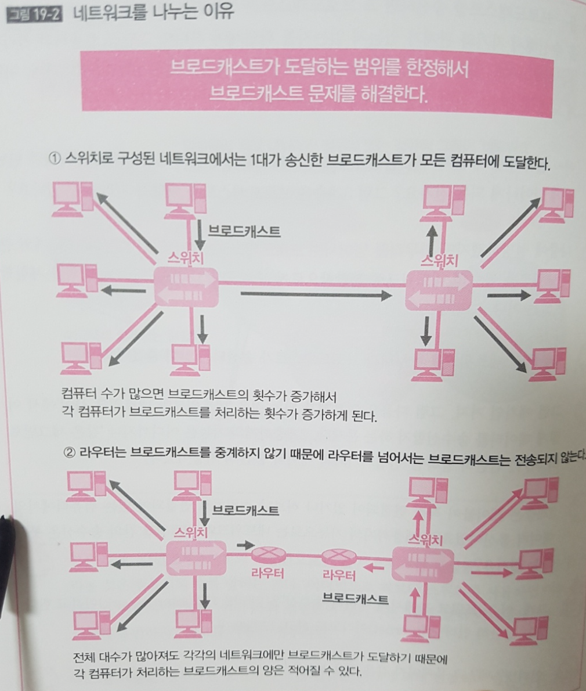

## OSI 7레이어, 3계층의 역할과 개요

### TL;DR

- 좁은 의미의 네트워크는 라우터로 나눠이진 '컴퓨터 그룹'을 말한다.
- 네트워크 간에서 데이터 통신을 하는 것을 인터넷 작업이라 한다.
- 3계층에서는  인터넷 작업을 수행한다.

### 네트워크

#### 1계층과 2계층의 역할 

- 1계층은 전기적인 '케이블이 연결되어 있는 상태에 대한 신호전달' &rarr; 케이블을 통해 신호를 건네주는 역할
- 2계층은 '신호 송수신 가능한 상태' 에서 '세그먼트 내에서 어떻게 데이터를 주고 받는지' &rarr; 상위층으로 신호를 제대로 송수신하는 순서를 생각하는 역할

#### 세그먼트 

- 세그먼트란 &rarr; 라우터와 라우터간의 범위, 이 세그먼트 내에서 데이터의 송수신을 하는 것이 2계층의 역할, 하지만 이것으로는 세그먼트 내의 컴퓨터끼리만 데이터 송수신 가능 
- 세그먼트를 초월한 데이터 송신을 위해서는 새로운 방법과 규칙이 필요(3계층)

#### 3계층과 네트워크

- '패킷 교환기인 라우터를 지나서 다른 세그먼트로 데이터를 보내고 그것을  생각하는 것이 3계층` &rarr;  세그먼트 내에서가 아니라 세그먼트 간에서의 데이터 송수신을 하는 것이 3계층 
- 세그먼트라는 말은 1계층과 2계층에서 사용하는 것이고, 3계층에서 이것과 같은 범위를 네트워크라 부름
- **3계층에서 지칭하는 네트워크는 세그먼트와 동의어**로써, **라우터와 라우터로 분배된 그룹**이라는 의미를 가짐
- 정리하면, 네트워크란 '컴퓨터의 그룹' 이고 2계층까지의 '세그먼트'와 같은 범위를 말함
- 세그먼트와 같은 것이기 때문에 네트워크 내의 컴퓨터끼리는 2계층에 의해 연결되어 있음 
- 즉, 멀티엑세스, 포인트 투 포인트 네트워크 형태로 컴퓨터가 연결되어 있어, 1계층에서 신호를 전달하고, 2계층에서 그것을 제어함으로써 데이터를 송수신할 수 있는 상태가 되는 것 

### 인터넷 작업 

- 네트워크 내라면 2계층 까지만으로 데이터 송수신이 가능하지만 2계층 만으로는 큰 네트워크를 구성할 수 없음, 여기서 '큰' 이라는 것은 컴퓨터의 수를 말하는 것
- 이더넷으로 허브나 스위치를 사용하면 어느 정도의 규모는 만들 수 있지만, 여러가지 걸림돌이 생김 
- 스위치는 유니캐스트 송수신의 경우 충돌을 방어하지만, 학습하지 않은 주소의 수신, 브로드캐스트, 멀티캐스팅을 플러딩하기 때문에 여전히 충돌 가능성이 있음
- 브로드캐스트를 송신하면 그 브로드캐스트가 도달하는 범위의 모든 컴퓨터가 그것을 수신해서 자기와 관계가 있는지 없는지를 확인해야 하는데, 그만큼 컴퓨터의 처리가 증가하는 하는데, 이는 대수가 늘어나면 브로드캐스트의 총 수도 늘어나기 때문임
- 정리하면 컴퓨터가 수가 많아지만 브로드캐스트가 송신되서 그만큼 확인처리가 빈번하게 일어나게 되는데 이 처리를 위해 3계층이 필요하다. **'핵심은 라우터를 넘어서는 브로드캐스트는 송신되지 않는다'** 이다.

- 1개의 큰 네트워크를 복수의 네트워크로 분할해서 브로드캐스트가 도달하는 범위를 제한할 수 있는 것, 네트워크를 나누니까 브래드캐스트가 송신되는 양이 줄음
- 다음으로 문제가 되는 것은 '네트워크와 네트워크 사이에서 어떻게 데이터를 송수신할 것인가' 하는 문제인데, 이 네트워트 간에서의 데이터 송수신을 **'인터넷 작업(internetwork)'** 이라고 부른다. 
- 즉, 3계층은 인터넷 작업을 수행하는 것이 그 역할. 인터넷 작업에 의해 떨어진 위치에 있는 컴퓨터끼리 데이터 통신이 가능해짐
- 