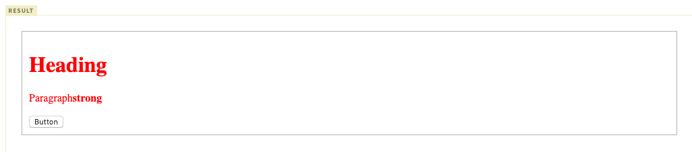
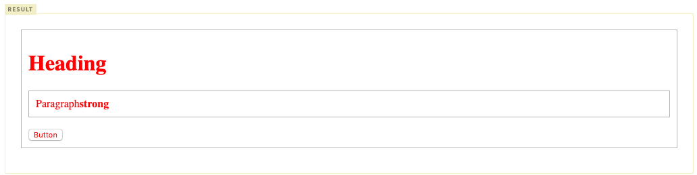

## TL:DR

- CSS 상속의 개념
- CSS 상속이 되는 속성과 안되는 속성의 특징
- CSS 상속을 하지 않는 요소들 

## 들어가며

이제 막 CSS를 시작했다. 상속을 활용해 CSS 코드를 줄이고 싶은데 어떤 부분은 상속이 되고, 어떤 부분을 상속이 되지 않고 복잡하다. 복잡함을 극복하고자 하기 내용을 정리한다.

## 상속이란?

- 상위(부모, 조상) 요소에 적용된 프로퍼티를 하위(자식, 자손) 요소가 물려받는 것을 의미
- 상속기능이 없다면 각 요소의 Rule set에 프로퍼티를 매번 각각 지정 해야함 
- 모든 프로퍼티가 상속되지는 않으며, 프로퍼티 중에는 상속되는 요소와 되지 않는 요소가 있음 
- W3C가 제공하는 [Full property table](https://www.w3.org/TR/CSS21/propidx)의 `Inherited 필드가 yes` 인 프로퍼티만 상속된다.

> ## Full property Table

|       property        | Inherit |
| :-------------------: | :-----: |
|     width/height      |   no    |
|        margin         |   no    |
|        padding        |   no    |
|        border         |   no    |
|      box-sizing       |   no    |
|        display        |   no    |
|      visibility       |   yes   |
|        opacity        |   yes   |
|      background       |   no    |
|         font          |   yes   |
|         color         |   yes   |
|      line-height      |   yes   |
|      text-align       |   yes   |
|    vertical-align     |   no    |
|    text-decoration    |   no    |
|      white-space      |   yes   |
|       position        |   no    |
| top/right/bottom/left |   no    |
|        z-index        |   no    |
|       overflow        |   no    |
|         float         |   no    |

## 상속되는 속성

### 종류(글자색 등 글자 디자인과 관련된 속성)

- color
- font-size
- font-family
-  letter-spacing

### 특징  

- 요소의 **상속되는 속성**에 값이 지정되지 않은 경우, 요소는 부모 요소의 해당 속성의 계산 값을 얻는다. 
- 오직 문서의 루트 요소만 속성의 요약절에 주어진 초기 값을 얻습니다.

### 예제

- 상속되는 속성의 대표적인 예는 color 속성

- CSS 스타일 규칙:

```css
p {
  color: green;
}
```

- HTML 마크업:

```html
<p>이 단락은 <em>강조된 텍스트</em>를 포함하고 있습니다.</p>
```

- `em` 요소는 `p` 요소로 부터 `color` 속성 값을 상속했기 때문에, **"강조된 텍스트"**는 녹색으로 보이며, 속성의 초기값(black)이 아닌 상속을 통해 보여진다.

### 상속되는 속성이지만 상속이 안되는 경우

- `<button>`, `input` 처럼 요소에 따라 부모,조상의 상속 받지 않는 경우가 존재한다.
- `html` 에서 해당 요소들을 컴포넌트 취급하여 별도의 스타일을 부여하고 있기 때문이다.

#### 예시

```html
<!DOCTYPE html>
<html>
<head>
  <meta charset="utf-8">
  <style>
    .text-red {
      color: red;
      border: 1px solid #bcbcbc;
      padding: 10px;
    }
  </style>
</head>
<body>
  <div class="text-red">
    <h1>Heading</h1>
    <p>Paragraph<strong>strong</strong></p>
    <button>Button</button>
  </div>
</body>
</html>
```



- 해당 요소들에도 동일하게 상속을 시키기 위해서는 inherit 키워드를 사용하여 명시적으로 상속받게 해야 한다.

```html
<!DOCTYPE html>
<html>
<head>
  <meta charset="utf-8">
  <style>
    .text-red {
      color: red;
      border: 1px solid #bcbcbc;
      padding: 10px;
    }
    .text-red button {
      color: inherit;
    }
    .text-red p {
      border: inherit;
      padding: inherit;
    }
  </style>
</head>
<body>
  <div class="text-red">
    <h1>Heading</h1>
    <p>Paragraph<strong>strong</strong></p>
    <button>Button</button>
  </div>
</body>
</html>
```




## 상속되지 않는 속성

### 종류 (공간과 관련된 속성)
- outline
- margin
- border
- padding

## 특징 

- 요소의 **상속되지 않는 속성**에 어떤 값이 지정되지 않는 경우, 요소는 그 속성의 초기 값을 얻는다

### 예시

- 상속되지 않는 속성의 대표적인 예는 `border` 속성

- CSS 스타일 규칙:

```css
p {
  border: 3px solid #333;
}
```

- HTML 마크업:

```html
<p>이 단락은 <em>강조된 텍스트</em>를 포함하고 있습니다.</p>
```

- "emphasized text"는 테두리가 없다. `border-style` 의 초기 값이 `none` 이기 때문이다.

> ## 참고 자료 
>
> - [poiemaweb 스타일의 상속과 적용 우선 순위](https://poiemaweb.com/css3-inheritance-cascading)
>- fastcampus 프론트엔드 입문 인터넷 강의 by 야무
> 

