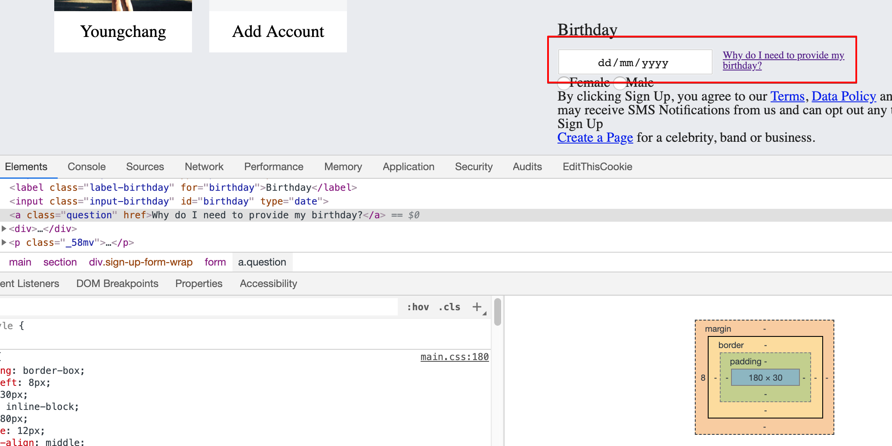

## inline box 2개가 같은 줄에 있을 경우



- 둘 중 하나의 padding 을 조정하면 나머지 하나도 같이 조정된다.
- 이 때 속성값이 명시적으로 조정되는 것은 아니다.
- 위치상으로 함께 떨어지는 것 처럼 보일 뿐이다.

```css
.input-birthday {
  box-sizing: border-box;
  width: 180px;
  height: 30px;
  margin-top: 12px;
  display: inline-block;
  text-align: center;
  padding-left: 44px;
}

.question {
  box-sizing: border-box;
  margin-left: 8px;
  height: 30px;
  display: inline-block;
  width: 180px;
  font-size: 12px;
  vertical-align: middle;
}
```
