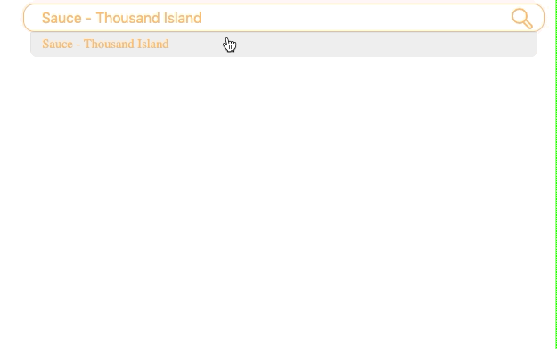

## 이슈 

검색창에 단어를 입력하면 검색 자동완성 이벤트가 발동해 검색어 목록을 보여준다. 리스팅 된 검색어로 검색을 하기 위해 클릭을 했는데 click 이벤트가 발동하지 않는다. 어떻게 된걸까? mouse event와 blur 이벤트의 순서에 대해 이해하면 원인을 알 수 있다. mousedown, mouseup, click & blur 이벤트 순서에 대해 알아보자.  

## mousedown, mouseup, click & blur 이벤트 순서

1. 사용자 마우스를 누르면서 &rarr; `mousedown event` 발동
2. (특정 영역에 `focus` 된 요소가 있다면 해당 요소의 `blur`(`foucsout`둘의 차이는 `bubbling` 에 있다) `event` 발동
3. 마우스에서 손가락이 떨어지며   &rarr; `mouseup event` 발동
4. `click event` 발동 

### 이해를 위한 Codepen

  See the Pen <a href="https://codepen.io/godotwait/pen/xvVMYp/">
  mousedown, mouseup, click &amp; blur order</a> by godotwait (<a href="https://codepen.io/godotwait">@godotwait</a>)

## 문제 원인 파악하기

`click event`가 일어나기 전에 `blur event`가 먼저 발생하여 `click event`가 발생하기 전에  검색어 링크가 `dom` 에서 삭제된다. `click event`  대신에 `mousedown event`를 활용하면 `blur event` 발동과 무관하게 원하는 로직을 사용할 수 있다.    