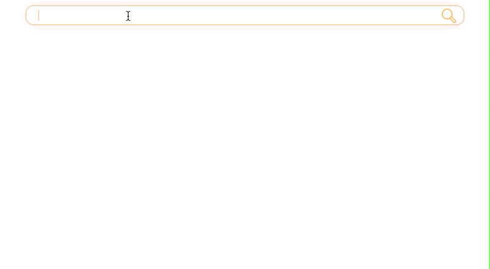
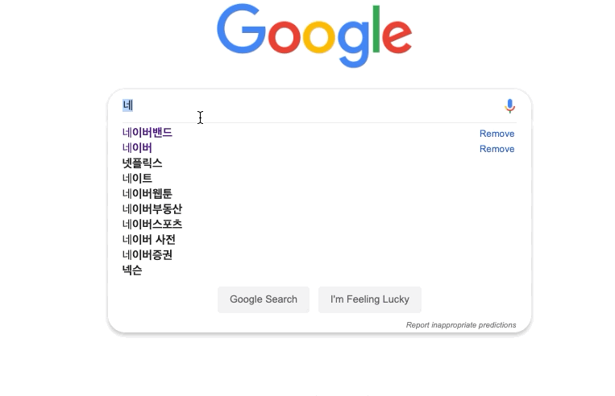
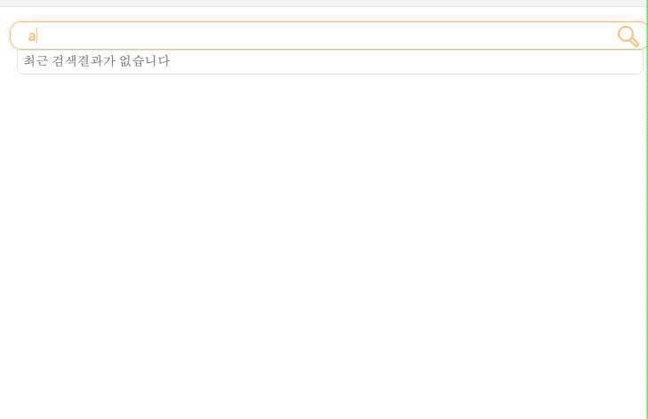
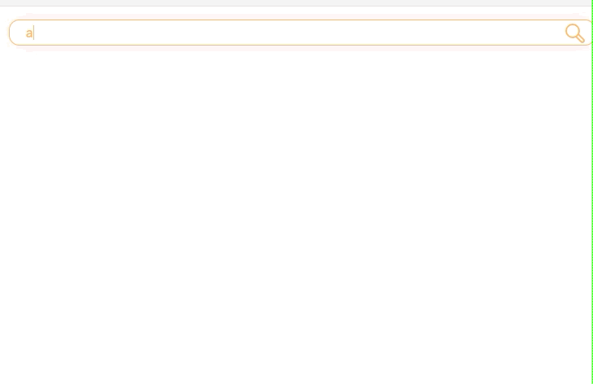

## TLDR

- Vanila JS로 검색 자동완성 라이브러리를 만든다. 
- 코드의 재사용을 고려하여 객체를 설계했고 설계과정에서 **MVC 패턴**을 적용했다. 
- 사용자와 성능을 고려하여 **debounce, throttle** 등의 **프론트엔드 에서의 UI 제어 기술**을 사용하였다.
- CSS 와 소스 데이터를 import 하는 부분은 범용성(db, json) 을 위해 추가적으로 수정이 필요하다. 
- 전체 소스코드는 [여기서](https://github.com/P-iknow/javascript-amazon/tree/step15-1/step15) 확인 가능하다.

## 1. 변화에 대응할 수 있는 설계

- 이번 라이브러리를 만들때 목표는 변화에 잘 대응하는 객체 설계이다. 
- 변화에 잘 대응하기 위해 변화율이 높은 역할을 구분하고, 그 역할을 다른 역할과 격리 시켜야 한다. 
- 자바스크립트의 객체설계와 역할 모델 등에 대한 개념은 [코드스피츠의 강의](https://youtu.be/bgP_1l7aJnc)를 듣고 감을 잡게 되었다. 여러분도 참고하시면 좋겠다.

### 1-1. 역할들 

- 사용자 입력에 따른 함수 실행(검색어 입력, 자동완성 결과 네비게이션, 결과 클릭 및 엔터)
- 화면 그리기 
- 데이터(상태) 저장
- 전달받은 데이터에서 자동완성 결과 추출 

### 1-2. 변화율이 높은 역할들 

- 전달받은 데이터에서 자동완성 결과 추출
  - 어떤 데이터가 들어오냐에 따라 데이터 추출 로직이 바뀜 
  - 데이터 추출에 관한 함수를 optional 하게 관리하여  변화에 잘 대응하기 
- 화면 그리기
  - 어떤 데이터가 들어오냐에 따라 template이 달라짐
  - template 함수를 optional 하게 관리하여 변화에 잘 대응하게 하기 
- **화면그리기와 데이터추출의 역할을 특정 객체에 한정하여 격리 시키자.**
  - resultView(결과를 그려주는 view) 가 격리되야 할 것으로 판단됨 
- 여기서 optional 한 관리를 어떻게 구현해야하는가? 
  - 첫째, 추상 class 를 상속 받아서 각 구상 class에서 해당 함수들을 overriding 
  - 둘째, 해당 함수를 인자로 으로 받아서 처리 
  - 현재 맥락에서 둘중에 어떤 구현이 좋은 선택이지 잘 모르겠음 

### 1-3. 역할 할당

#### 1-3-1. resultView 

- 전달받은 데이터에서 자동완성 결과 추출 
- 자동완성 및 최근 검색어 결과 화면 그리기 

#### 1-3-2. InputView

- 키보드 조작에 따른 검색결과 focus 및 input 영역 value 값 조정(navigation)

#### 1-3-3. Controller

- 사용자 입력에 따른 함수 실행(검색어 입력, 자동완성 결과 네이게이션, 결과 클릭 및 엔터)

#### 1-3-4.  Model

- 데이터(상태) 저장

## 1-4 이벤트 흐름

**자주 바뀌는 역할은 resultView 가 담당한다**


### 1-6. Code

#### 1-6-1. app.js

controller가 view와 model을 주입받아 활용한다.

```js
const inputView = new InputView();
const resultView = new ResultView();
const model = new Model();
const controller = new Controller();

controller.inputView = inputView;
controller.resultView = resultView;
controller.model = model;

```

#### 1-6-2. config.js

**자주 바뀔 것으로 예상되는 템플릿 생성 함수와 데이터 처리는 config.js 로 격리시켜 따로 조정하도록 한다. **

```js
const global = {
  inputEl: '.autoComplete_input',
  resultEl: '.autoComplete_result',
  resultItem: 'autoComplete_result_item',
  resultItemHighlighted: 'autoComplete_result_item-highlighted'
};

export const model = {
  srcUrl: './src/data.json'
};

export const controller = {
  inputEl: global.inputEl,
  resultEl: global.resultEl,
  resultItem: global.resultItem,
  resultItemHighlighted: global.resultItemHighlighted,
  debounceDelay: 300
};

export const inputView = {
  inputEl: global.inputEl,
  onSelect: 'onSelect',
  throttleDelay: 60
};

export const resultView = {
  resultEl: global.resultEl,
  resultItem: global.resultItem,
  resultItemHighlighted: global.resultItemHighlighted,
	
  // 잦은 변경이 예상되는 템플릿 함수들 
  noResultSuggestionTemplate() {
    //...
  },

  noResultRecentQueryTemplate() {
    //...
  },

  recentQueryTemplate(recentQueryList) {
		//...
  },
	
  suggestionTemplate(query, suggesions) {
		//....
  },
	
  // 잦은 변경이 예상되는 데이터 처리함수
  getAutoSuggesionList({ dataSrc, query, config }) {
		//...
  },
};


```

#### 1-6-3. ResultView

**ResultView 에서는 confing.js 를 import 한 뒤 사용한다.**

```js
import { resultView as config } from './config.js';

class ResultView {
  constructor() {
    this.resultEl = document.querySelector(config.resultEl);
  }

  renderRecentQuery(dataSrc) {
    this.resultEl.innerHTML = '';
    this.resultEl.style.display = 'block';
    const template =
      dataSrc.length === 0
        ? config.noResultRecentQueryTemplate() //conifg를 여기서 
        : config.recentQueryTemplate(dataSrc);
    this.resultEl.insertAdjacentHTML('afterbegin', template);
  }

  renderSuggestion(dataSrc, query) {
    this.resultEl.innerHTML = '';
    this.resultEl.style.display = 'block';
    const suggestions = config.getAutoSuggesionList({
      dataSrc,
      query,
      config
    });
    const template =
      suggestions.length === 0
        ? config.noResultSuggestionTemplate()
        : config.suggestionTemplate(query, suggestions);
    this.resultEl.insertAdjacentHTML('afterbegin', template);
  }
}

export default ResultView;
```

### 1-7 변화 상황 시나리오를 통해 변화에 잘 대응하는지 살펴보기 

변화에 잘 대응하는 견고한 코드 작성을 목표로 했으니 실제로 변경 요청이 있을 때 본인이 작성한 코드가 변화를 잘 받아들일 수 있는지 검증해야 한다. 실무에서 으레 있을 법한 상황을 토대로 시나리오를 구성해봤다.   

#### 1-7-1 변화 상황 시나리오

기본 자동검색은 보통은 아래와 같은 view를 제공한다.


그런데 이 검색 자동 완성 코드를 영화검색에 쓴다고 하는데, 영화검색에서 요구하는 결과 화면이 기존 검색완성 과는 다르다 어떻게 대응해야 하는가? 


#### 1-7-2 변화 상황에 대응하기

##### 코드의 재사용 가능성? 

시나리오를 확인해보니 기본적인 기능(검색어 입력, 검색결과 네이비게이션 등)은 똑같지만 검색결과(resultView) 화면이 다르다. **그렇다면 전달받은 데이터소스를 처리하는 함수와, 처리된 데이터를 통해 화면을 그리는 템플릿 함수만 변화하면 기존에 사용했던 코드를 재사용 할 수 있다.  변화하는 내용을  config.js 내부에 resultView 객체에 있는 함수들을 변경 하면 된다. 변화를 예상하고 격리시켜 놨기 때문에 해당 변경은 다른 객체에 영향을 주지 않는다. 코드를 안심하고 변경할 수 있다.**  

##### 실제 바꿔야하는 코드 

아래 코드에서 템플릿 함수 (`recentQueryTemplate` , `suggestionTemplate`) 와 데이터 처리 (`getAutoSuggesionList`) 만 바꿔주면 나머지 코드는 그대로 재사용이 가능하다.  목표달성이다. 짝짝짝!!

```js
// config.js
const global = {
	...
};

export const model = {
  srcUrl: './src/data.json'
};

export const controller = {
	...
};

export const inputView = {
	...
};

export const resultView = {
	// 템플릿 - 최근 검색 결과 
  recentQueryTemplate(recentQueryList) {
		...
  },
	
  // 템플릿 - 자동 완성 결과 
  suggestionTemplate(query, suggesions) {
		...
  },
	
  // 데이터 처리 - 모델로 부터 전달받은 데이터에서 자동완성 데이터를 추출하는 함수 
  getAutoSuggesionList({ dataSrc, query, config }) {
		
  },
};

```

## 2. 고급 UI 제어

###  * Debounce 및 Throttle 이해를 위한 참고자료

- 아래에서는 프론트엔드 고급 UI 제어 기술인 `debounce` 와 `throttle` 에 대해 다룬다. 
- 보다 더 나은 이해를 위해서 [이 게시물](https://codeburst.io/throttling-and-debouncing-in-javascript-b01cad5c8edf)을 참고하면 좋다.  

### 2-1. Debounce(사용자 입력시)

#### 2-1-1. 문제되는 상황

```js
// Controller.js
attatchEvent() {
	this.inputEl.addEventListener('keyup', e => this.doByInputKeyUp(e));
}

// keyup 이벤트 실행시 매번 doByInputkeyup 콜백이 실행되고
doByInputKeyUp(e) {
    switch (true) {
      case e.key === 'ArrowDown' || e.key === 'ArrowUp':
        break;

      case e.key === 'Enter':
        this.model.addRecentQuery(e.target.value);
        break;

      default:
        // 검색어 입력인 경우 handleSuggestions 함수가 매번 실행된다.
        this.handelSuggestions(e.target.value);
    }
  }
```

사용자가 특정 문자열을 입력할 때마다 매번 `handelSuggestions` 함수가 발동된다.  여기서 **매번**이 문제가 된다. 사용자는  본래 의도한 특정 문자열을 완성시키기 위해 연속적으로 키보드 입력을 한다. 입력이 연속적으로 들어온다는 것은 사용자가 자신의 의도를 아직 다 표현하지 않았음을 의미한다. 사용자가 의도한 문자열 입력을 완료하지 않은 상태에서 굳이 자동완성 결과를 매번 보여줄 필요가 없으며 이는 리소스 낭비일 수 있다. (아래 화면을 보면 입력시마다  `handelSuggestions` 함수가 실행되어 자동완성 목록이 업로드 된다.) 


#### 2-1-2. Debounce 를 통한 해결 

**사용자가 입력을 모두 마쳤을 때   `handelSuggestions`  가 한번만 발동되도록 하고, 연속적인 입력이 들어오면 아직 입력을 마치지 않은것으로 간주하여 함수 실행을 지연시키면 많은 리소스를 절약할 수 있다. 이런 전력을 취해 할 수 있는 UI 제어기법이 `debounce` 이다**

```js
// debounce.js 
export default (func, delay) => {
  // 이때 inDebounce는 클로저이다.
  let inDebounce; // timeoutID
	// debounce 함수의 실행으로 반환되는 함수
  return (...args) => {
    clearTimeout(inDebounce);
    inDebounce = setTimeout(() => func(...args), delay);
  };
};

// 컨트롤러에서 debounce 사용
class Controller {
  constructor() {
    this.inputEl = document.querySelector(config.inputEl);
    this.resultEl = document.querySelector(config.resultEl);
    // debounce 함수 실행
    this.handelSuggestions = debounce(
      this.handelSuggestions.bind(this),
      config.debounceDelay
    );
    this.attatchEvent();
  }
}
```

**debounce의 로직은 아래와 같다.**

- **`debounce` 함수는 `let` 키워드를 통해 `inDebounce` 변수를 선언한다.  그 후` arguments(인자)`를 받아서 delay 만큼 지연되지 않았을 경우 이전에 등록했던 `setTimeout`을 지우고 새로` setTimeout` 을 등록함으로써  `callback` 함수의 실행을 지연하는 함수를 반환한다. 반환되는 함수에서 `inDebounce` 변수가 사용되는데 이는 `closer` 공간에 존재하는 `자유변수(freeVariable)` 이다.**
- 반환된 함수가 setTimeout 함수를 실행하기 전에 `clearTiemout` 함수를 실행하는데 이때 인자로 전달되는 `inDebounce`는 `debounce 함수의 실행으로 반환된 함수에서 내부`에서  `setTimeout의 실행` 으로 반환된 `timeoutID` 이다. 
- `clearTimeout`이 실행되면 이전에 `setTimeout` 을 통해  등록했던  `callback` 지연실행이 해제된다. 등록해제 이후 곧 바로  새로운 `setTimeout` 실행을 통해 새로운 지연 실행을 예약한다. 
- **delay가 300ms** 인 경우를 예로 들어 이해해보자.

```js
// 1. keyup 이벤트 발생 
this.inputEl.addEventListener('keyup', e => this.doByInputKeyUp(e));

// 2.doByInputKeyup 실행
doByInputKeyUp(e) {
			// 3. handelSuggestions 실행 
       this.handelSuggestions(e.target.value);
    }
  }

// debounce 를 통해 반환된 함수 내부
(...args) => {
  	// 4. clearTimeout 실행 
    clearTimeout(inDebounce); // 첫번째 실행이므로 inDebounce = undefined, 
  	// 이때 inDebounce는 closure 공간에 존재하는 자유변수(freeVariable) 
  	
  	// 5. handleSuggestion 함수 300ms 지연실행 등록 
  	// 여기서 func 는 handleSuggestion 임
    inDebounce = setTimeout(() => func(...args), delay);
  	// 6. setTimeout 함수가 반환한 timeout Id가 inDebounce 변수에 저장됨
  	//  - 이때 inDebounce 변수는 closer 공간에 존재하는 자유변수(freeVariable)
  	//  - 그로 인해 다음함수가 실행될 때도 이전에 저장했던 inDebounce를 참조하여 사용할 수 있음
  };

// 7. 두번째 keyup 이벤트 발생 (300ms 가 아직 지나지 않은 경우)
this.inputEl.addEventListener('keyup', e => this.doByInputKeyUp(e));

// 8.doByInputKeyup 실행
doByInputKeyUp(e) {
			// 9. handelSuggestions 실행 
       this.handelSuggestions(e.target.value);
    }
  }

// debounce 를 통해 반환된 함수 내부
(...args) => {
  	// 10. clearTimeout 실행 
    clearTimeout(inDebounce); // 5. 에서 등록했던 setTimeout이 해제됨 
  	// 이때 inDebounce는 closure 공간에 존재하는 자유변수(freeVariable) 
  	
  	// 11. handleSuggestion 함수 300ms 지연실행 등록 
  	// 여기서 func 는 handleSuggestion 임
    inDebounce = setTimeout(() => func(...args), delay);
  	// 12. setTimeout 함수가 반환한 timeout Id가 inDebounce 변수에 저장됨
  	//  - 이때 inDebounce 변수는 closer 공간에 존재하는 자유변수(freeVariable)
  	//  - 그로 인해 다음함수가 실행될 때도 이전에 저장했던 inDebounce를 참조하여 사용할 수 있음
  };

// 13. 이벤트 발생 후 300ms 가 흘렀을 때 
// func()에 등록된 handelSuggestions 함수 실행  
```

디바운스 적용을 한 결과는 아래와 같다. 같이 최종적으로 입력이 완료될 때 까지 자동완성이 보이지 않다가, 모든 입력이 완료된 이후에 한번만 자동완성 결과를 보여준다. 이렇게 하면 매번 callback을 실행하지 않아 리소스를 절약할 수 있다. 

#### 2-1-3. debounce 적용 before, after

실제 화면으로 보니 예상대로 잘 동작한다. 짝짝짝!!!

##### before - 입력시 마다 매번 `handelSuggestions` 함수 실행  


##### after - 입력이 모두 완료됬을 때 한번만 `handelSuggestions` 함수 실행  




### 2-1 Throttle (검색결과 네비게이션)

#### 2-1-1. 문제되는 상황

```js
attatchEvent() {
  	// 검색어 입력에 대응하는 keyup 이벤트
    this.inputEl.addEventListener('keyup', e => this.doByInputKeyUp(e));
		// 자동완성 결과 네비게이션에 대응하는 keydonw 이벤트
    this.inputEl.addEventListener('keydown', e => this.doByInputKeyDown(e));
}

// ArrowDown, ArrowUp 키 입력시 inputView의 navigate 함수 작동
doByInputKeyDown(e) {
  if (e.key === 'ArrowDown' || e.key === 'ArrowUp') {
    e.preventDefault();
    this.inputView.navigate(this.resultEl, e.key);
  }
}
```


사용자가 자동완성된 결과를 보고 특정 검색어에 도달하기 위해 키보드로 커서(`focus`)를 제어(`navigation`) 할때,  보통은 해당 자동완성 결과에 도달할 때 까지 키보드를
쭉 누른다.(쭉 누르는 행동을 반영하기 위해서는 `keyup` 이벤트가 아닌 `keydown`이벤트를 적용해야 한다. `keyup`은 키보드를 눌렀다 땠을 때 발생하기 때문에 연속적인 키보드 반응을 대응하기에 부적합하다.) 구글의 검색창 기능은 이를 반영한 UI를 제공한다. 



구글 검색창 UI와 동일한 느낌을 제공하기 위해 `keydown` 이벤트를 이용하여 `navigation` 함수를 발동시켰다.  사용자가 `up or down Arrow key`를 누르는 동안  연속적으로  `navigation` 함수가 발동되는데 함수의 발동속도가 예상보다 무척 빨라 사용자 눈으로 하이라이트  에니메이션을 따라가기가 힘들어 키보드 제어가 어렵다.




#### 2-2-2 throttle 적용으로 문제 해결하기 

1초(1000ms)에 `keydown` 이벤트가 100번(가상의 예) 작동한다면  100번 중에 16번만 `navigation` 함수가 실행 되게 만들어 사용자가 제어할 수 있는 UI를 구현할 수 있다.  **여기서 100번 중에 16번으로 함수의 실행횟수를 제한하는 작업이 바로 `throttle` 이다.** `throttle` 을 사용하면 사용자에게 제어가능한 UI를 제공할 수 있고 덤으로 함수의 실행을 최소화시켜 리소스도 절약할 수 있다. 이제 `throttle` 적용을 코드로 살펴보자

```js
// throttle.js 
export default (func, delay) => {
  let inThrottle;
  // throttle 함수의 실행으로 반환되는 함수
  return (...args) => {
    if (!inThrottle) {
      func(...args);
      inThrottle = true;
      setTimeout(() => {
        inThrottle = false;
      }, delay);
    }
  };
};


// inputView에서 throttle사용
class InputView {
  constructor() {
    this.inputEl = document.querySelector(config.inputEl);
    // throttle 함수 실행
    this.navigate = throttle(this.navigate.bind(this), config.throttleDelay);
  }
}
```

**throttle** 로직은 다음과 같다.

- **`throttle` 함수는 `let` 키워드로  `inThrottle` 변수를 선언한다. 그 후에 인자로 받았던`delay` 만큼 시간이 지나지 않았다면 인자로 받은 `callback` 함수를 실행시키지 않는 함수를 반환한다.(`delay`가 지났다면 `callback`을 실행시킨다) 반환되는 함수 내부에서 `inThrottle`이 사용되는데 이 변수는 클로저 공간의  `자유변수(freeVariable)` 이다.**
- 반환된 함수가 실행될 때 `inThrottle` 변수의 값을 통해 분기를 나눈다.  `inThrottle` 변수의 값이 `undefined`(처음 실행하는 경우),  `false`(`delay` 시간이 지나서 `inThrottle` 변수의 값이 `false`로 바뀐 경우) 일 때 특정 로직이 실행된다. 
- 위 조건을 만족하는 경우`argument(인자)`가  `callback` 함수에 전달되어 실행되고 `inThrottle` 변수에 `true` `boolean` 값을 할당한다. 다음으로 `delay` 만큼 시간이 지난 후 `inThrottle`변수에  `false`  를 할당하도록  `setTimeout` 함수에 callback`inThrottle = false`)을 전달하여 실행시킨다.
- **delay가 60ms** 인 경우를 예로 들어 이해해보자.

```js
// 1. keydown 이벤트 발동
attatchEvent() {
		// 자동완성 결과 네비게이션에 대응하는 keydonw 이벤트
    this.inputEl.addEventListener('keydown', e => this.doByInputKeyDown(e));
}

// 2. DoByInputKeyDown 함수 실행 
doByInputKeyDown(e) {
  if (e.key === 'ArrowDown' || e.key === 'ArrowUp') {
    // 3. ArrowDown, ArrowUp 키 입력시 inputView의 navigate 함수 작동
    this.inputView.navigate(this.resultEl, e.key);
  }
}

// throttle 함수 실행으로 반환된 함수 내부
  return (...args) => {
// 4. inThrottle 변수의 값이 undefined(처음 실행하는 경우), false(delay 시간이 지나서 inThrottle 변수의 값이 false로 바뀐 경우)만 아래 로직 실행, true(아직 delay만큼 시간이 지나지 않은 경우)에는 callback이 실행되지 않고 종료됨
    if (!inThrottle) {
      // 5.  this.inputView.navigate 함수에 ...args 를 전달하여 실행
      func(...args);
      inThrottle = true;
      // 6.delay 가 지나 setTimeout 함수의 콜백이 실행되기 전까지는 inThrottle은 true 가 되고 
      // 다음번 함수가 실행될 때 (!inThrottle)가 false로 판정되어 this.inputView.navigate가 실행되지 않음
      setTimeout(() => {
        //7. delay 만큼 시간이 지난 후 inThrottle = false; 실행되고 다음번 함수가 실행될 때
        // if(!inThrottle) 가 true 로 판정되어 this.inputView.navigate 실행됨
        inThrottle = false;
      }, delay);
    }
  };
```

### 2-2-3 Throttle 적용 before, after 
실제 동작을 확인해보니 예상처럼 작동한다 짝짝짝!! 
##### before - 이벤트가 발생하는 모든경우에 콜백함수가 실행되어 사용자가 네비게이션을 제어하기 어려움


##### after - 이벤트에 발생할 때 특정 시간동안 콜백함수의 실행을 제한하여 사용자가  제어할 수 있는 UI 제공




## 마치며

### 변화 대응 전략

변화가 잦은 코드에 대응하기 위한 전략으로 2가지를 생각했다. 2가지 전략을 활용 해봐도 아직 뚜렷한 장단점 혹은 어떤 맥락에서 어떤 전략을 선택해야 할지 파악하지 못했다. 추후 이 내용을 좀 더 발전시켜 내가 사용한 코드에 근거를 마련해야 한다.

1. 추상 클래스에 특정 메소드를 정의하고, 구상 클래스에서 해당 메소드를 overriding 하는 방법
2. 변화가 잦은 함수들을 인자로 받아서 처리하는 방법

### 경험이 답이다.

코드스쿼드 과정 이전의 공부는 단순히 책을 읽거나 코드를 수동적으로 따라치는 것에 불과했다. 그게 더 빠르고 효율적인 공부라고 생각했다.

