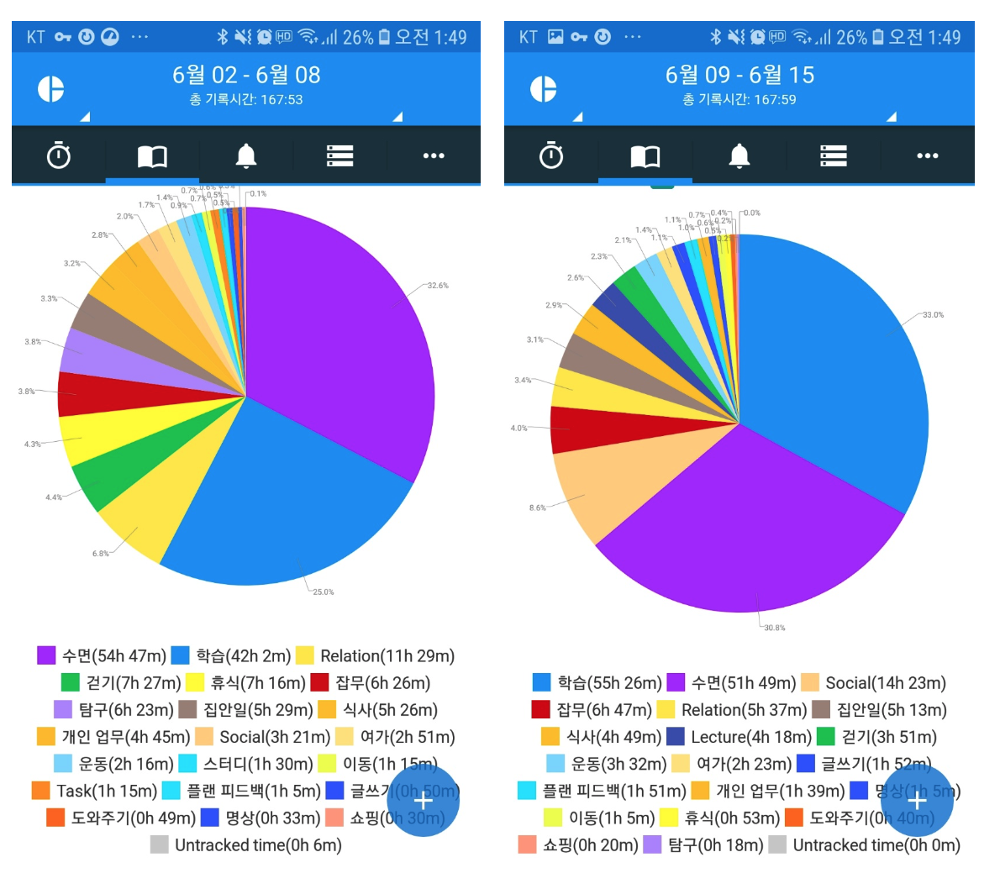

## 배운 것

- carousel UI
- dom 제어, Event
- cssom
- 제어문

## 잘한 것

- 회복

## 못한 것

- 조급함 때문에 많은 것을 놓쳤다. 명상하고 숨을 돌리자. 중간에 끊고 쉬도록 노력하자.
- 중간 중간 고삐를 놓고 유튜브, 뉴스 영상 본 것
- 잡무시간이 6시간 이상된다. 해당 시간에 좀 더 유익한 활동이나 재미를 추구할 수 있다.
- 놀아도 주도적으로 놀자

## 이번주 도전

- [ ] 케스케이딩 관련 글 작성
- [x] 코드스피츠 CSS 강의 에니메이션 이전까지 듣기
- [x] dom API 살펴보기
- [x] 매일 알고리즘 문제 관여하기(못풀어도 10분이상 고민할 것)
- [x] flex 적용 하기
- [x] 모던 웹을 위한 html, css 5 완성

## 다음주 도전

- [ ] 케스케이딩 관련 정리 및 학습
- [ ] 모던 웹을 위한 html, css 6,7 완성
- [ ] SASS, BEM amazone 클론 하기(Koon, Snow)
- [ ] 코드스피츠 JS 기초강의 모두 듣기

## FEEDBACK

### 조급병 (19.06.11)

주변에서 뭔가 결과물이 나오고, 과정 이외의 것에 도전한다. 나는 여전히 html, css 에서 버벅거리고 있다. 다시 조급해진다. 그러나 조급해 한다고 좋아지는 건 없다. 학습에 조급병이 방해만 될 뿐이다. 나는 나의 속도와 계획이 있다. 대신 이론에 너무 매몰되면 안된다. 필요한 걸 만들면서 검색하며 배우자. 이론은 키워드 중심으로 공부한다. 주변 사람들에게 이론에 빠지지 않도록 푸쉬 해 달라는 요청을 하자.
