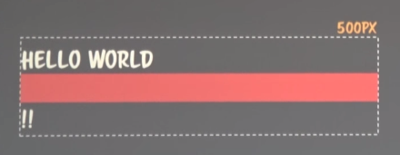

---

title: TIL 190609 | template tag fucntion
date: '2019-06-09T10:46:37.121Z'
template: 'post'
draft: false
slug: 'til/190609'
category: 'TIL'
tags:
  - 'TIL'
  - 'Log'
  - 'JS'
  - 'template tag function'
description: 'template tag function 에 대해 공부했다.'

---
## NOMAL FlOW

- CSS 2.1 visual formatting model
    - positioning schemes & nomal flow

### position?

- 그래픽스 시스템에서 Geometry  left(x), top(y) 결정할 때 추상적인 위치를 결정할 때 쓰이는 결정 방식
- fixed number 로 바뀔 때 쓰이는 계산방법

### Nomal Flow

- static, relative → O
- absolute, fixed, inherit  → X

## BFC

- 한 줄을 다 먹는 애들(Block)을 어떻게 계산할 것인가?

### Block

- 부모의 가로 길이를 가득 채운 한 줄(가로를 다 먹는 애들)

### 기본 계산 로직

- 첫번째 block의 시작점은 부모의 x,y(left, top) 좌표
- 두번째 block의 시작점은 첫번째 block의 height
- 세번째 block의 시작점은 첫번째, 두번째의 heigh의 합
- 부모의 가로 길이는 내부 블록들의 합

## IFC

### inline

- 한 줄을 다 먹지 않고 나의 컨텐츠 크기 만큼만 geometry를 먹는다.

### 계산로직

- 첫번째 inline width 만큼을 x 좌표로 그림
- inline 요소의 width 합이 부모 요소의 width를 넘어갈 경우 해당 요소는 다음 줄로 떨어진다.
    - 근데 얼마만큼 떨어 지나면 지금 인라인을 구성하고 요소 중 가장 높은 heigt 가 큰 애가 line height 가 되어서 그게 y값이 됨
- Base Line
    - 인라인 요소 중 가장 큰 것을 base로 y 축을 어떻게 정렬할 것인가?

## BFC, IFC 공통 적용

- IFC 영역의 로직이 실행 되다가도 Block 이 등장하면 context가 BFC 로 변경
- dom 의 포함관계와 렌더링시스템(화면을 그리는)은 무관하다.
- 화면을 그리는 것은 BFC, IFC 가 관장한다
```html
    <div style="width:500px;">
      HELLO
      <span>
          WORLD
          <div style="background:red">&nbsp</div>
      </span>
      !!
    </div>
```



### Relative 와 Static 요소가 같은 위치에 그려질 때

- Relative가 우선하는 규칙이 있다.
- Relative 끼리는 Z index로 경합을 벌인다. 

## `new.target`

- 여기서 `new`는 객체가 아니다. `new.target` 자체가 하나의 값이다.

[https://developer.mozilla.org/en-US/docs/Web/JavaScript/Reference/Operators/new.target]()

```js
// 생성자 함수를 일반 함수처럼 사용하지 못하게 방어하는 코딩방법
function Person (name) {
  if (this instanceof Person) { // new 키워드와 함께라면 this가 새로 생성될 instance를 가르킴
    this.name = name
  } else { // 일반함수라면 this 는 window를 가르키고, 결국 에러발생
    throw new Error('new 연산자를 사용하세요.')
  }
}
// 정상
var p1 = new Person('재남')
console.log(p1)

// 에러
var p2 = Person('성훈')
console.log(p2)

// 에러
var p3 = Person.call({}, '곰')
console.log(p3)

// p1 은 Person의 instance 이기 때문에 정상작동
// 여기가 바로 우회수단이다!!
var p4 = Person.call(p1, '곰')
console.log(p4) //곰
console.log(p1) //곰 this가 p1을 가르켰고 name에 곰이 할당됬다.

// 어떻게 해결할까?
```

```js
// 위의 new 연산자 사용을 강제하기 위한 방법을 보다 명시적으로 하기 위해 new.target 등장 

function Person (name) {
  console.dir(new.target)
  if (new.target !== undefined) {
    this.name = name
  } else {
    throw new Error('new 연산자를 사용하세요.')
  }
}

// 정상 작동
const p1 = new Person('재남') // new.target == Person || undefined
console.log(p1)

// 에러
const p2 = Person('성훈')
console.log(p2)

// 에러
const p3 = Person.call({}, '곰')
console.log(p3)

// 에러 드디어 우회를 막았다
const p4 = Person.call(p1, '곰')
console.log(p4)
```

```js
 // arrow function 은 this, new.target, agrument 를 bind 하지 않는다. 
function Person (name) {
  const af = n => {
    this.name = n
    console.log(new.target)
  }
  af(name)
}
const p1 = new Person('재남') // arrow function의 new.target도 역시 Person 이 나옴
const p2 = Person('성훈')
```

```js
// 이전의 우회방법
function Person (name) {
  this.name = name  
}
function Android (name) {
  Person.call(this, name)
}

// new.target === Android, 이기 때문에 오류 발생 x
const p1 = new Android('재남봇')
```

```js
// 안전장치 걸기
function Person (name) {
  console.log(new.target)
  if (new.target === Person) { //undefined 보다 명시적으로 사용하기
    this.name = name
  } else {
    throw new Error('Person 생성자함수를 new로 호출해야 해요!')
  }
}
function Android (name) {
  Person.call(this, name)
}
const p2 = new Android('재남봇')
```

```js
// class의 상속에서 더 의미를 가지는 new.target

// new A 로는 활용할 수 없도록 제한 걸기
// javascript에서는 추상클래스(<-> 구체클래스)가 없기 때문에 이런 로직이 필요함 

class A { // 추상 클래스처럼 흉내내기 
  constructor () {
    if (new.target === A) throw new Error("A는 추상클래스 입니다.")
    console.log(new.target)
  }
}

class B extends A {
  constructor () {
    super()
  }
}

const b = new B();
const a = new A();
```

## 


>  ## 참고 
>
>  - 코드스피츠 CSS 렌더링