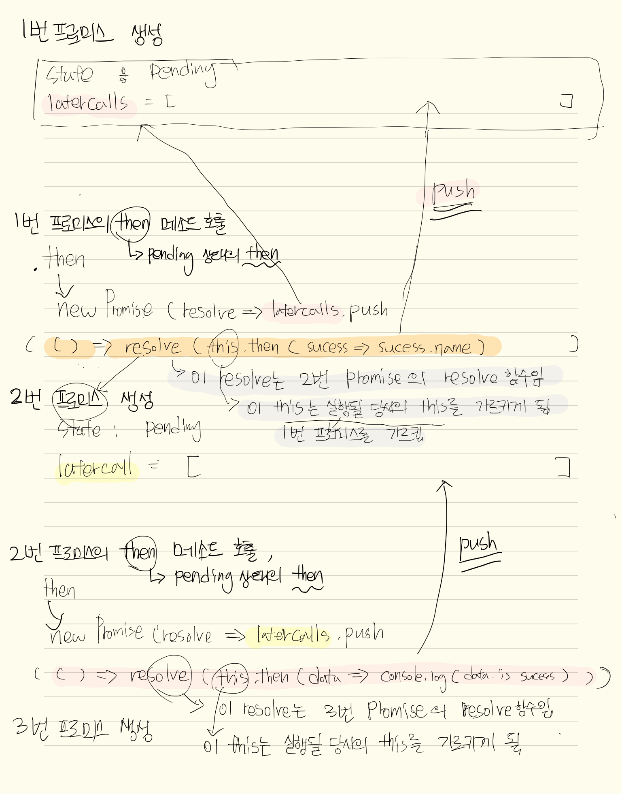
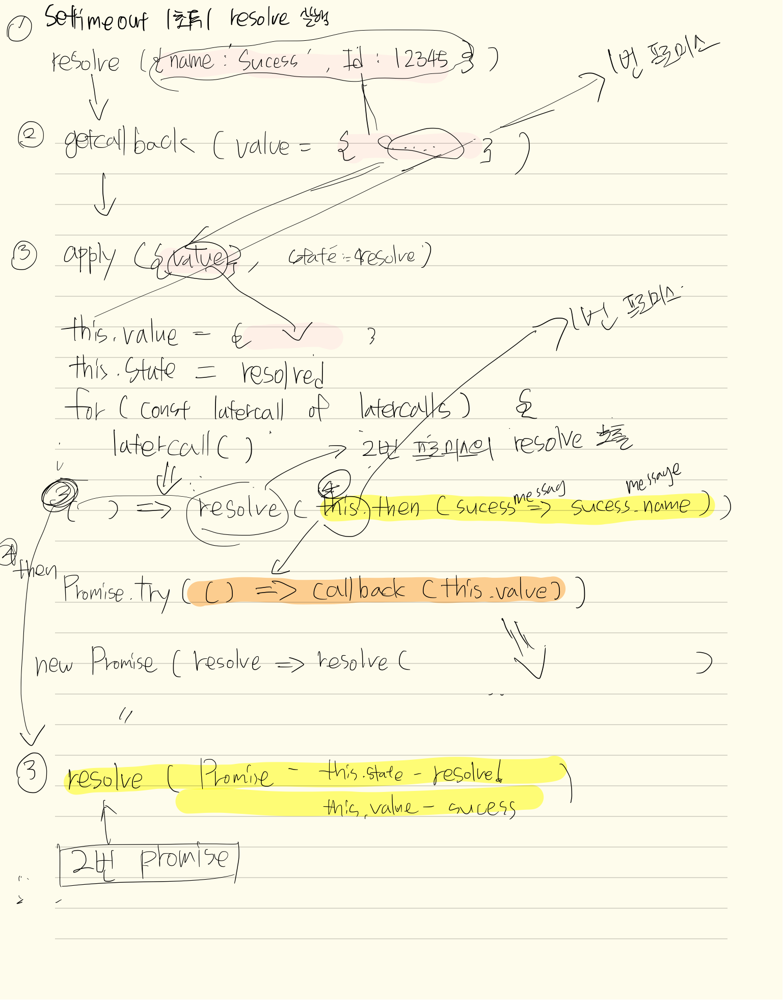
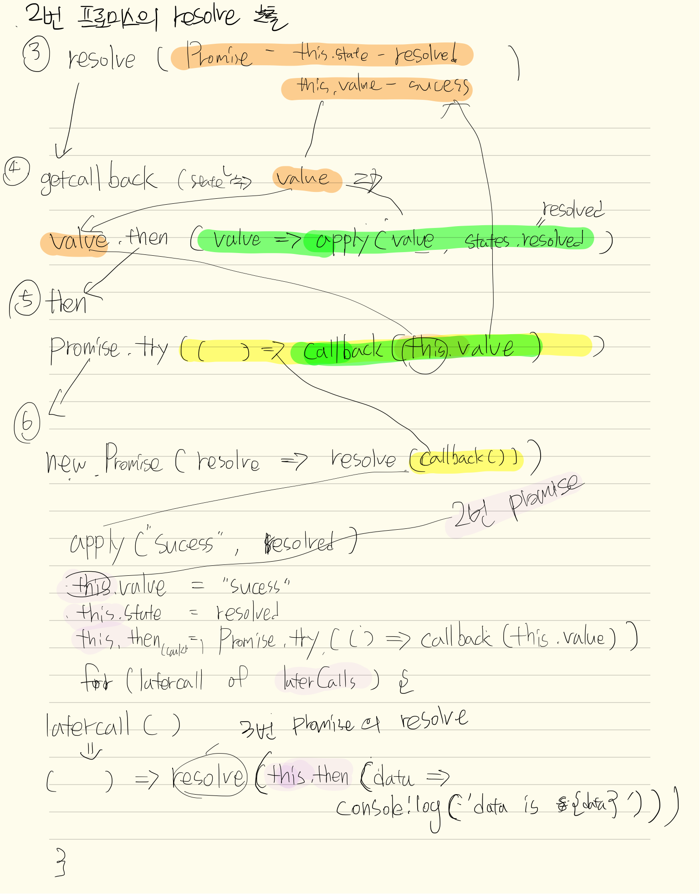
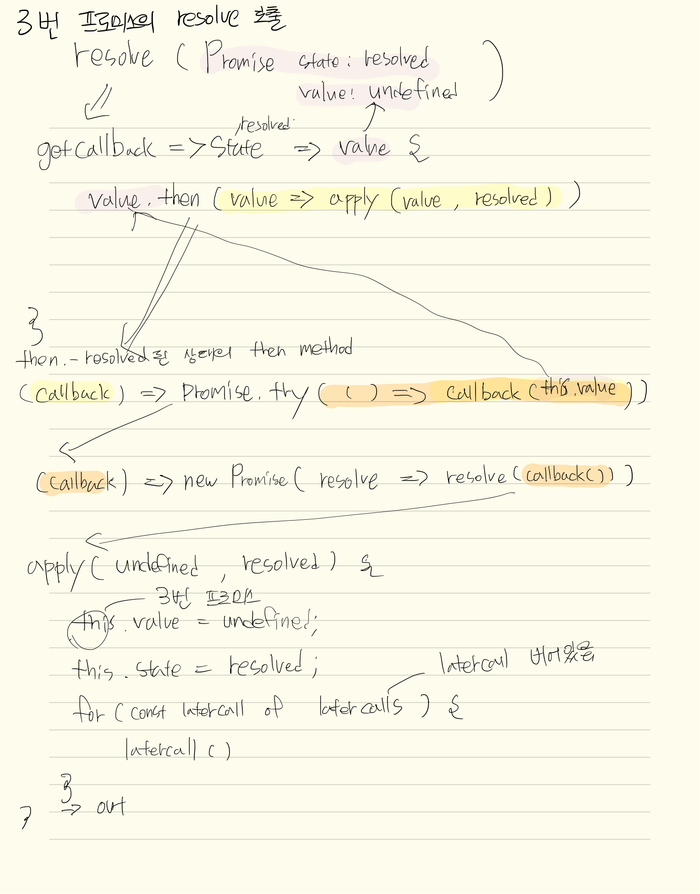

## 프로미스 구현 코드 

```js
const states = {
  pending: 'Pending',
  resolved: 'Resolved',
  rejected: 'Rejected',
};

class MyPromise {
  constructor(executor) {
    const laterCalls = []; // closure
    const callLater = getMember => callback =>
      new MyPromise(resolve =>
        laterCalls.push(() => resolve(getMember()(callback))),
      );
    const members = {
      [states.resolved]: {
        state: states.resolved,
        // Chain mechanism
        then: callback => MyPromise.try(() => callback(this.value)),
        catch: _ => this,
      },
      [states.rejected]: {
        state: states.rejected,
        // Ignore mechanism
        then: _ => this,
        catch: callback => MyPromise.try(() => callback(this.value)),
      },
      [states.pending]: {
        state: states.pending,
        then: callLater(() => this.then),
        catch: callLater(() => this.catch),
      },
    };
    const changeState = state => Object.assign(this, members[state]);
    const apply = (value, state) => {
      if (this.state === states.pending) {
        this.value = value;
        changeState(state);
        for (const laterCall of laterCalls) {
          laterCall();
        }
      }
    };
    const getCallback = state => value => {
      if (value instanceof MyPromise && state === states.resolved) {
        value.then(value => apply(value, states.resolved));
        value.catch(value => apply(value, states.rejected));
        // Either 'then' or 'catch' will happen here, not both
        // No need for more ifs!
      } else {
        apply(value, state);
      }
    };

    const resolve = getCallback(states.resolved);
    const reject = getCallback(states.rejected);
    changeState(states.pending); //this.state = states.pending;

    try {
      executor(resolve, reject);
    } catch (error) {
      reject(error);
    }
  }

  static resolve(value) {
    return new MyPromise(resolve => resolve(value));
  }

  static reject(value) {
    return new MyPromise((_, reject) => reject(value));
  }

  static try(callback) {
    return new MyPromise(resolve => resolve(callback()));
  }
}

let myFirstPromise = new MyPromise((resolve, reject) => {
  setTimeout(() => {
    resolve({ name: 'Success!', id: 123123 });
  }, 1000);
})
  .then(successMessage => {
    return successMessage.name;
  })
  .then(data => {
    console.log(`data is ${data}`);
  });

```

## 함수 플로우 










