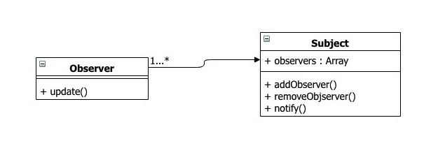

## 모듈 간의 상호 의존성은 왜 발생할까?

 먼저 의존성 자체에 대해 생각해보자. 일반적으로 모듈은 특정 기능을 수행하는 단위로 구상/구현됩니다. 최초 모듈 구현시에는 작게 시작되지만 기능이 추가될수록 모듈의 기능 범위가 넓어지게 된다. 그러다 보면 모듈에 있어서는 안되는 함수(function)나 프로퍼티(property)가 슬슬 끼어들게 된다. 이런 요소들이 발견되었을 때가 바로 리펙토링을 수행해야 할 시점이다. 리펙토링으로 분리된 모듈은 기존 모듈의 입장에서는 연관성이 덜하여 분리되었지만 전체적인 구조에서는 기존 모듈과 밀접한 관계를 맺게 된다. 그만큼 두 모듈의 결합도는 높아지게 되고 상호 참조가 많은 부분에서 발생한다. 단일 모듈로 구성된 프로그램이 아닌 이상 모듈 간 의존성은 자연스러운 부분이다.

## 의존성을 최소화시키려면 어떻게 해야 될까?

 의존성을 최소화하기 위해서는 근본적으로 각 세부 모듈들의 범위를 조절하는 것이 중요하다. 적절히 필요한 단위로 모듈을 구성하여 모듈 간의 인터페이스를 최소화하는 것이다. 상호 참조가 과하다는 점은 두 모듈이 합쳐질 수 있는 여지가 있다는 신호이기도 하다. 그럼에도 불구하고 다수의 모듈과 상호 작용이 필요한 경우라면 옵저버 패턴을 사용하여 상호 의존성을 제거할 수 있다.

## 옵저버 패턴(Observer pattern)이란?

   옵저버 패턴은 디자인 패턴을 살펴봤다면 아주 익숙한 디자인 패턴 중 하나다. 각 모듈의 중간에서 서로의 상태 변화를 관찰하는 관찰자 객체를 만드는 것이 바로 옵저버 패턴이다. 각 모듈은 서로 알아야 하는 상태변화가 있을 때마다 상대 모듈에게 필요한 데이터와 함께 상태가 변했음을 관찰자(observer)를 통하여 통보(notify)  한다. 이 통보를 받은 관찰자는 통보한 모듈에서 넘겨준 데이터를 인자로 해당 상태변화와 연관된 각 모듈의 핸들러들을 호출하여 각 모듈이 필요한 작업을 수행할 수 있도록 해준다. 물론 각 모듈에서는 어떤 상태변화에 어떤 핸들러가 호출이 되어야 하는지 미리 옵저버에게 등록해두어야 한다. 글로 적으니 엄청 복잡한 것 같은데 우리에게 익숙한 코드로 세부 내용을 알아보자.


### Subject 와 Observer



```js
class Subject {
  constructor() {
    this.observers = [];
  }

  // Add an observer to this.observers.
  addObserver(observer) {
    this.observers.push(observer);
  }

  // Remove an observer from this.observers.
  removeObserver(observer) {
    const removeIndex = this.observers.findIndex(obs => {
      return observer === obs;
    });

    if (removeIndex !== -1) {
      this.observers = this.observers.slice(removeIndex, 1);
    }
  }

  // Loops over this.observers and calls the update method on each observer.
  // The state object will call this method everytime it is updated.
  notify(data) {
    if (this.observers.length > 0) {
      this.observers.forEach(observer => observer.update(data));
    }
  }
}

export default Subject;
```
### Observer

```js
class Observer {
  // Gets called by the Subject::notify method.
  update() {}
}

export default Observer;
```

### State

```js
import Subject from "./Subject";

class State extends Subject {
  constructor() {
    super();
    this.state = {};
  }

  // Update the state.
  // Calls the update method on each observer.
  update(data = {}) {
    this.state = Object.assign(this.state, data);
    this.notify(this.state);
  }

  // Get the state.
  get() {
    return this.state;
  }
}

export default State;
```
### Componet
```js
import Observer from "../lib/Observer";

class List extends Observer {
  createMarkup(state) {
    return `<ul>
    ${state.users.map(user => `<li>${user.name}</li>`).join("\n")}
    </ul>`;
  }

  render(state, selector = "app") {
    const markup = this.createMarkup(state);
    const parent = document.getElementById(selector);

    parent.innerHTML = markup;
  }

  // This method will be called by the Subject(state) whenever it updates.
  // Notice how it prompts a re-render.
  update(state) {
    this.render(state, "user-list-container");
  }
}

export default List;
```

### 위 코드의 데모

[Click here for the demo!](https://codesandbox.io/s/vqq4vvxl20?view=preview)