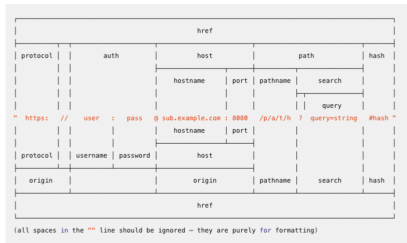

## 서버의 역할 

request 를 분석해서 그에 해당하는 response 

- 정적파일 제공하는 서버 (nginx, apach) 
- 동적서버 WAS, TOMCAT 
- API 응답용 서버(AWS Lamda, Google Cloud Function)


## url 분석



## 서버의 코드

### 간단한 서버

```javascript
const http = require('http');

const server = http.createServer((req,res) => {
    res.writeHead(200, {'Content-Type': 'text/html'});
    res.end('hello world ');
});

server.listen(8080,  ()=> {
    console.log(`server is running on 8080`);
})
```

### request 객체에서 정보를 추출

request에는 모든 것이 담겨져 있음.(url, queryString…)

```javascript
const http = require('http');
const url = require("url"); //아직 사용하진 않고 있음.


const server = http.createServer((req,res) => {
    console.log(req.method, req.url);

    res.writeHead(200, {'Content-Type': 'text/html'});
    res.end('hello world ');
});

server.listen(8080,  ()=> {
    console.log(`server is running on 8080`);
})
```

------

### Routing

url 을 분석해서, 많은 request정보를 분석할 수 있다.

\# url 정보 참고 : https://nodejs.org/docs/latest/api/url.html#url_url_strings_and_url_objects

```javascript
const http = require("http");
const url = require("url");
const fs = require("fs");  // 여기

const server = http.createServer((req, res) => {

  console.log(req.method, req.url);
  const { pathname } = url.parse(req.url, true);  // 여기

  if (pathname === "/index") {
    console.log("index routing");
    //index.html 파일을 만들자.
    fs.readFile("index.html", (err, data)  => {
      res.writeHead(200, { "Content-Type": "text/html" });
      res.write(data);
      res.end();
    });
  } else {
    res.writeHead(404, { "Content-Type": "text/html" });
    res.end("404 Not Found >.<");
  }
});

server.listen(8080, () => {
  console.log(`server is running on 8080`);
});
```

### queryString 추출도 가능

```javascript
//http://localhost:8080/index?name=crong

const { pathname, query:{name}} = url.parse(req.url, true);
//....
res.write(data + `<span>${name}님과 함께 ^^</span>`);
```

### GET요청만처리

```javascript
if (req.method ==="GET" && pathname === "/index") {
```

### JSON 응답

```javascript
res.writeHead(200, { "Content-Type": "application/json" });
res.write(JSON.stringify({"lists" : ['crong', 'pobi']}));
res.end();
```

**fetch 요청** (브라우저 콘솔에서 합시다)

```javascript
fetch("/index")
.then((res) => res.json())
.then(({lists}) => {
  console.log(lists.reduce((p,n)=> p + `<p>${n}</p>`,``));
});
```

## Real world - examples

Express 를 활용한 백엔드 서버 구성에 대해서 알아보자

아래는 괜찮은 사례 중 하나.

https://github.com/gothinkster/node-express-realworld-example-app