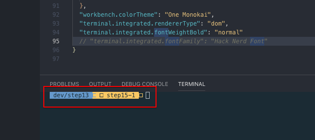
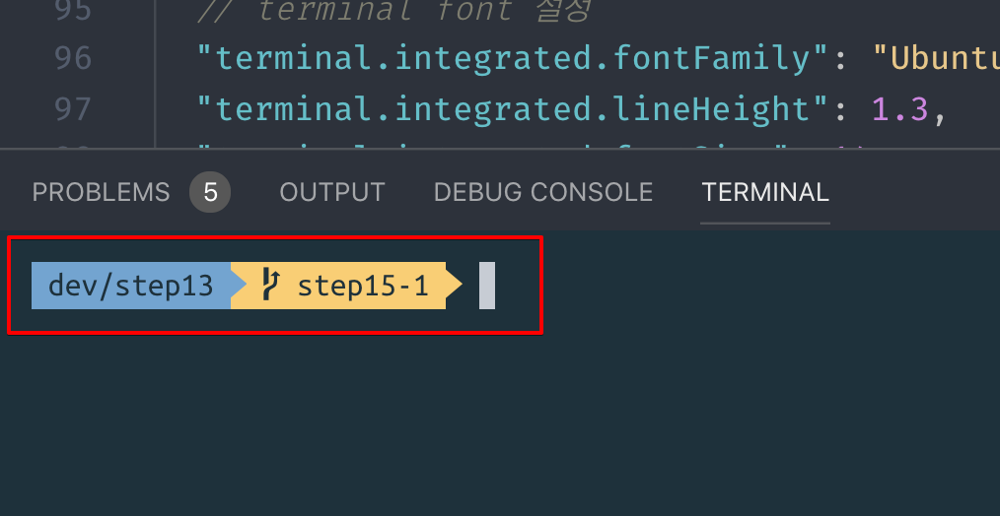

## 들어가며 

 멋진 터미널을 만들기 검색을 하고,  [블로그(아마도 이 블로그)](https://beomi.github.io/2017/07/07/Beautify-ZSH/)를  참고했을 것이다. oh-my-zsh 를 깔고, 테마를 적용하고 짜잔 멋진 터미널이 탄생했다. 그런데 vs code 내부의 터미널에서 터미널을 열었더니  뭉게진 git 아이콘이 덩그러니 있다.  "무엇이 문제일까?" 해당 아이콘은 powerline 이라고 불리는 폰트의 기능(?) 인데 폰트가 powerline 옵션을 지원해야 한다. "그래서 어떡해야 하는가?" 그래서 정리했다.




## 1. Powerline 폰트를 설치하자 (MAC 기준)

```bash
# clone ->  폰트를 다운받고
git clone https://github.com/powerline/fonts.git --depth=1

# install 
cd fonts  # -> 다운받은 폴더로 이동한다
./install.sh   # -> 폴더 내에 설치파일을 실행한다. 

# clean-up a bit
cd ..        # -> 다시 폴더 바깥(한단계 상위폴더)으로 나와서
rm -rf fonts  # -> 다운받은 폴더를 깔끔하게 지워준다.
```

## 2. vscode terminal font 설정  

- `CMD + ,` 를 누르면 설정(preference) 창이 뜬다.
- 상단 검색창에 `terminal font`를 검색하면 아래와 같이 terminal > intergrated: Font Family 창을 볼 수 있다. 
- 폰트를 `Ubuntu Mono derivative Powerline` 로 설정한다.  ([Powrline 을 지원하는 모든 글꼴](https://github.com/powerline/fonts) 중 아무거나 선택해도 무방하다 본인은 iterm 과 동일한 폰트를 선택했다.)


### setting.json 에서 수정해도 무방하다.

```.json
{  
  // terminal font 설정
  "terminal.integrated.fontFamily": "Ubuntu Mono derivative Powerline",
  "terminal.integrated.lineHeight": 1.3,
  "terminal.integrated.fontSize": 14,
}
```

## 3. 정상으로 그려지는 git icon 확인

짜잔~~!!, 이제 vscode 에서도 정상적으로 그려지는 git icon을 확인할 수 있다.

